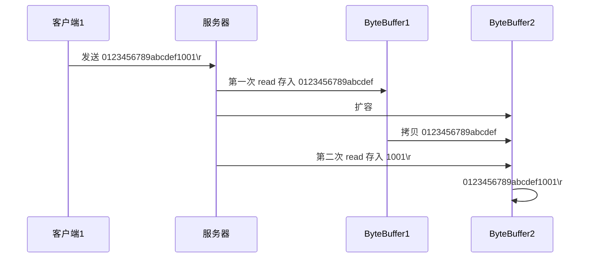

# Java模组开发学习计划2024.07

## Gradle构建工具 【学习成本相对高】

### 零，认识阶段

1. 了解Ant、Maven、Gradle的本质及各自的优缺点

   可以从**以下角度**来进行横向对比

   * 构建性能高低

   * 仓库

   * 依赖支持

   * 插件支持

   * 是否遵循特定目录结构

   * 配置文件编写难易度

   * 项目侧重点

   * 目前地位


2. Gradle项目目录结构

     * 基于Covention Over Configuration
     * 与Maven项目结构大体差不多

3. Gradle中常用指令

|   常见的Gradle指令   |            作用            |
| :------------------: | :------------------------: |
|     gradle clean     |       清空build目录        |
|    gradle classes    |  编译业务代码何和配置文件  |
|     gradle test      | 编译测试代码，生成测试报道 |
|     gradle build     |          构建项目          |
| gradle build -x test |        跳过测试构建        |

*gradle指令要在含build.gradle的项目目录下执行

4. Gradle Wrapper包装器
   * 理解其在整个项目中的作用
   * 什么时候适合使用包装器【官方为什么推荐使用其】

### 一,  Gradle与IDEA结合阶段

 1. #### Groovy编程语言

    * 一种成熟面向对象的编程语言（既能用于面向对象编程，也可以纯粹作为脚本语言编程）

    * 可被视作为Java的一种脚本化改良版

    * 可运行在JVM上

    * 良好的与Java代码及其相关库进行交互操作

      > [!TIP]
      >
      > 大多数有效的Java代码可以被转化为有效的Groovy代码，
      >
      > 后者与前置的主要区别在于完成相同的任务所需要的代码量更少

      **特点:**

      1. 功能强大 【支持动态类型转换、闭包和元编程(metaprogramming)】

      2. 支持函数式编程，无需main函数

      3. 默认导入常用的包

      4. 类不支持default作用域，默认作用域为public

      5. Groovy中基本类型也是对象，可以直接调用对象的方法

      6. 支持DSL(Domain Specific Languages 领域特定语言) 和其它简洁的语法, 让代码变得易于阅读和维护

      7. Groovy基于Java语言的，所以是完全兼容Java语法，因此对于Java程序员学习成本较低 

         **详细了解请参考** [[Groovy Language Documentation (groovy-lang.org)](https://docs.groovy-lang.org/latest/html/documentation/)]

         类似于Python于Java的结合

         学习其语法

         * 字符串字符串 ps 对于双引号类型""支持$变量运算能力，此时字符串类型为GString
         * 语句结构
         * 数据结构
         * 类型及权限修饰符
         * 集合操作
         * 类导入
         * 异常处理
         * 闭包（Closure）

    2. #### Gretty插件

    3. #### build.gradle配置文件编写

       1. Gradle的任务入门与任务行为
    
          1. task 定义 （Map<String, ?>，String ，Closure）
          2. task的doFirst、doLast行为【外置.doFirst 与内部 doFirst执行顺序注意】
    
       2. Gradle任务的依赖行为dependOn
    
       3. Gradle任务分组(group)
    
       4. Gradle任务定义的方式
    
          1. task()方式
          2. task.register()方式 延迟创建
    
       5. Gradle指定任务的属性
    
          任务的属性：
    
          1. type (Task) 类似于继承
          2. overwrite (Boolean) 是否替换存在的Task
          3. dependsOn (TaskList[])任务的依赖
          4. action 添加任务中的Action或闭包
          5. description
          6. group
    
          定义的方式 
    
          1. 具名参数 task(group: "分组名")
          1. 内部直接指定 group("分组名")
          1. 外部指定 xxx.group = "分组名"
    
    
    
    ​	

## Java 进阶编程

1. I/O操作

    1. BIO（BLOCKING I/O）C10K、C10M（Connect）问题

    2. NIO （NON-BLOCKING I/O）  效率不高（占用CPU）-> NIO多路复用器（一个线程多处理）

       ​	通过Epoll（【Linux】基于C语言和操作系统内核函数）事件轮询机制

       Redis线程模型 ，**Netty线程模型**（对NIO进行了大量优化，可以支持百万连接）

2. Java编程设计模式
   1. 链式编程

   2. 工厂设计模式


3. 并发编程思想
4. 其它java库（数学计算、图形绘制等等)

### <font color="red">**NIO**</font>

#### 1. 三大组件

##### 1.1 Channel & Buffer

Channel  有点类似于 stream，它是读写的**双向通道**，可以从 channel 中将数据读入 buffer，也可以将 buffer 的数据写入到 channel 中

> [!NOTE]
>
> stream要么是输入，要么是输出，因此channel 比 stream 更为底层


常见的 Channel 有

* FileChannel
* DatagramChannel
* SocketChannel
* ServerSocketChannel

buffer 则用来缓冲读写数据，常见的 buffer 有

* ByteBuffer
  * MappedByteBuffer
  * DirectByteBuffer
  * HeapByteBuffer
* ShortBuffer
* IntBuffer
* LongBuffer
* FloatBuffer
* DoubleBuffer
* CharBuffer

##### 1.2 Selector

需结合服务器的设计演化来理解

**多线程版设计**

````mermaid
stateDiagram-v2
state 多线程版 {
   Thread01 --> socket1
   Thread02 --> socket2
   Thread03 --> socket3
   }
````

多线程版服务器设计缺点: 1.内存占用高 `C10M`  2.线程上下文切换成本高 3.不适合大量连接数情况

**线程池版设计**

````mermaid
flowchart LR
subgraph 线程池版
   Thread01 --> socket1
   Thread01 -.-> socket2
   Thread02 --> socket3
   Thread02 -.-> socket4
end
   
````

线程池版服务器设计缺点: 1.阻塞模式下，一个线程只能处理一个Socket连接 2.仅适用短连接场景（即连接建立后即时通讯）

**selector 版设计**

seletor 的作用就是配合一个线程来管理多个 channel ，获取这些 channel 上发生的事件， 这些 channel 工作在**非阻塞**模式下， 不会让线程吊死在一个 channel 上。 适合连接数特别多，但流量低的场景（low traffic）

````mermaid
flowchart LR
subgraph selector 版
Thread --> selector
selector --> channel1
selector --> channel2
selector --> channel3
end
````

调用 selector 的`selector()`会阻塞直到 channel 发送了读写就绪事件，这些事件发送，selector方法就会返回这些事件交给 thread 来处理 （基于操作系统级别实现）

#### 2.ByteBuffer

##### 2.1如何正确使用

1. 向 buffer 写入数据，例如调用 channel.read(buffer)
1. 调用 flip() 切换到 **读模式**
1.  从 buffer 读取数据，例如调用 buffer.get()
1. 调用 clear() 或 compact() 切换至 **写模式**
1. 重复 1~4 步骤

##### 2.2ByteBuffer结构 

几个重要属性【分别理解初始状态、写模式写入状态、flip动作变化、clear动作变化、compact动作变化（从指针角度理解）】

* capacity
* position
* limit（读，写） 

##### 2.3 ByteBuffer常见方法

1. 分配空间 ByteBuffer.allocate(int)、allocateDirect（int）

   两者返回类型不同 前者使用的是Java堆内存HeapByteBuffer、后者是直接内存DirectByteBuffer

   Java堆内存读写效率低，会受 GC 的影响 ；后者是系统内存，读写效率高(少一次拷贝)，不受GC的影响，但分配内存效率低下，使用不当会有内存泄漏【Netty对此进行封装，提高了分配效率，更加安全】

2. 向buffer写入&读取数据

   1. put(xxx)写入

   2. get(i)读取（i为非空时，指向索引i位置，但position指针不会改变

   3. rewind()从头开始读

   4. mark() & reset() mark()做标记，记录 position  位置 , reset() 是将 position  重置到  mark 的位置

3. 字符串与ByteBuffer转化

   1. 字符串 -> ByteBuffer

       ```Java
       ByteBuffer buffer = ByteBuffer.allocate(16);
       buffer.put("[String]".getBytes());//调用完ByteBuffer处于写模式
       ```

   2. Charset

      ```Java
      ByteBuffer buffer = standardCharsets.UTF_8.encode("[String]");//调用完ByteBuffer会自动切换读模式
      /**/
      String str = StandardCharsets.UTF_8.decode(buffer).toString();//写模式转会有问题（从position位置向后转）
      ```
   
   3. wrap
   
       ```Java
       ByteBuffer buffer = ByteBuffer.wrap("[String]".getBytes());//调用完ByteBuffer会自动切换读模式
       ```

##### 2.4 Scattering Reads

​	分散读取：将要读入长字符串用多个ByteBuffer分别读入（重思想，轻代码实现）

##### 2.5 Gathering Writes

​	集中写入：将多个ByteBuffer组合在一起（重思想，轻代码实现）

##### 2.6 粘包/半包

​	网络上有多条数据发向服务端，数据之间假设用`\n`进行分隔，但出于某种原因，这些数据在接收时，被进行了重新排列组合，原来包有的被完整的组合在一起（粘包），有的被拆分成部分（半包），可以通过遇到方法来在服务器端重新组合排列还原好这些数据包

#### 3. 文件编程

##### 3.1 FileChannel

> [!WARNING]
>
> FileChannel 只能工作在阻塞模式下

**获取**

不能直接打开FileChannel，必须通过FileInputStream、FileOutputStream或者 RandomAccessFile来获取 FileChannel，它们都有getChannel() 方法

* FileInputStream 获取的 channel 只读
* FileOutputStream 获取的 channel 只写
* RandomAccessFile 能否读写根据 构造的RandomAccessFile时的读写模式来决定的

**读取**

会从 channel 读取数据填充ByteBuffer，返回值表示读取到了多少字节，-1表示到达了文件的结尾

```Java
int readBytes = channel.read(buffer);
```

**写入**

写入的正确方式如下：

```Java
ByteBuffer buffer = ... ;
buffer.put(...); //存入数据
buffer.flip();   //切换读模式

while(buffer.hasRemaining()) {
    channel.write(buffer);
}

```

在while中调用`channel.write()`是因为write方法并不能保证一次性将buffer中的内容全部写入到channel中

**关闭**

channel 必须关闭，不过调用了 FileInputStream 等的 close 方法会间接地调用 channel 的 close 方法 

**位置**

获得当前位置

```Java
long pos = channel.position();
```

设置当前位置

```Java
long newPos = ...;
channel.position(newPos);
```

设置当前位置，若设置为文件的末尾

* c=此时读取会返回-1
* 这时写入，会追加内容，但要注意如果 position 超过了文件末尾，再写入时在新内容和原末尾之间会有空洞 (00)

**大小**

 使用`size()`获取文件的大小

**强制写入**

操作系统出于性能的考虑，会将数据缓存，而不是立刻写入到磁盘里。可以调用 force(true) 方法来将文件内容和元数据（文件的权限等信息）立刻写入磁盘 

##### 3.2 两个channel传输数据

````Java
String FROM = "读入数据文件Path";
String TO = "写入数据文件Path";
try ( 
	FileChannel from = new FileInputStream(FROM).getChannel();
    FileChannel to = new FileOutputStream(TO).getChannel
) {
   //效率比直接通过数据流高，底层会用操作系统的零拷贝进行优化，但有 最大一次传输数据量上限(超出会被截取)
	from.tranferTo(0, from.size(), to);//position 大小 target    
} catch (IOException e) {
    e.printStackTrace();
}

````

改进版

````Java
long size = from.size();//left 变量代表还剩多少字节
for (long left = size; left > 0 ; ) {
    left -= from.transferTo((size - left), left, to);
}
/*==========================*/
long hasWritten = 0;//hasWritten 变量代表写入了多少字节
while(hasWritten < from.size()) {
    hasWritten += from.transferTo(hasWritten, form.size() - hasWritten, to);
}
````

##### 3.3 Path

jdk7引入了 Path 和 Paths 类、

* path 用来表示文件路径
* paths 是工具类，用来获取 path 实例

```Java
Path source = Paths.get("path");
/* 
"path":
	"1.txt" --- 相对路径 使用user.dir 环境变量来定位 1.txt
	"d:\\1.txt" --- 绝对路径 代表了 d:\1.txt
	"d:/1.txt" --- 同上
	"d:\\data","project" --- 代表 d:\data\projects
*/
```

* `.` 代表当前路径
* `..` 代表上一级目录

````
示例目录结构
d:
	| - data
		| - projects
			| - a
			| - b
````

代码

```Java
Path path = paths.get("d:\\data\\projects\\a\\..\\b");
System.out.println(path + "\n" + path.normalize());//普通 \n 正常化路径
/* Output:
	d:\data\projects\a\..\b
	d:\data\projects\b
*/
```


##### 3.4 Files

**检查文件&路径目录是否存在**

`Files.exists(path)`

**创建一级目录**

`Files.createDirectory(path)`

* 如果目录已存在，会抛 `FileAlreadExistsException`
* 不能一次创建多级目录，否则会抛异常 `NoShchFileException`

**创建多级目录**

`Files.createDirectories(path)`

**拷贝文件**

`Files.copy(source, target)`

* 若文件已存在，则会抛异常FileAlreadyExistsException

如果希望用 source 覆盖 target ，则需要用StandardCopyOption来控制

```Java
Files.copy(source, target, StandardCopyOption.REPLACE_EXISTING);
```

 **删除文件**

`Files.delete(target)`

* 如果文件不存在，则会抛异常  NoSuchFileException

**删除目录**

`Files.delete(target)`

* 若目录里还有内容，会抛异常 DirectoryNotEmptyException

**遍历目录文件**

```Java
package F20240703;

import java.io.IOException;
import java.nio.file.*;
import java.nio.file.attribute.BasicFileAttributes;
import java.util.concurrent.atomic.AtomicInteger;

@SuppressWarnings("preview")
public class TestFilesWalkFileTree {
    public static void main(String[] args) throws IOException {
        AtomicInteger dirCount = new AtomicInteger();
        AtomicInteger fileCount = new AtomicInteger();
        Files.walkFileTree(Paths.get("D:\\R39_s_Whimsy_NeoForgeModProject"), new SimpleFileVisitor<Path>() {
            @Override
            public FileVisitResult preVisitDirectory(Path dir, BasicFileAttributes attrs) throws IOException {
                System.out.println(STR."===>\{dir}");
                dirCount.incrementAndGet();
                return super.preVisitDirectory(dir, attrs);
            }

            @Override
            public FileVisitResult visitFile(Path file, BasicFileAttributes attrs) throws IOException {
                System.out.println(file);
                fileCount.incrementAndGet();
                return super.visitFile(file, attrs);
            }
        });
        System.out.println(STR."dirCount: \{dirCount.get()}");
        System.out.println(STR."fileCount: \{fileCount.get()}");
    }
}
```

**练习: 利用改方法来删除、拷贝多重文件目录**

#### 4. 网络编程

##### 4.1  非阻塞 vs 阻塞

###### **阻塞**

* 阻塞模式下，相关方法都会导致线程暂停
  * ServerSocketChannel.accept 会在没有连接建立时让线程暂停
  * SocketChannel.read 会在没有数据可读时让线程暂停
  * 阻塞的表现就是线程暂停了，暂停期间不会占用Cpu，但线程相当于闲置
* 单线程下，阻塞方法之间相互影响，几乎不能正常工作，需要多线程支持
* 但多线程下会有新的问题，体现在以下方面
  * 32位的JVM 一个线程 320K，64位的JVM 一个线程1024K，如果连接过多，必然会导致OOM，而且线程太多，反而会因为频繁的上下文切换导致性能降低
  * 采用线程池集合来减少线程数和线程上下文切换，治标不治本，如果有很多连接建立，但长事件inactive，会阻塞线程池中的所有线程，因此不适合长连接，只适合短连接

###### **非阻塞**

* 非阻塞模式下，相关方法都不会让线程暂停
  * 在ServerSocketChannel.accept 在没有连接建立时，会返回null，继续运行
  * SocketChannel.read 在没有数据可读时,会返回0,但线程不比阻塞，可以去执行其它的SocketChannel的 read 或是 去执行 ServerSocketChannel.accpet
  * 写数据时，线程只是等待数据写入Channel即可，无需等 Channel 通过网络把数据发送出去
* 但非阻塞模式下，即使没有连接建立，和可读数据，线程仍然不断运行，会浪费Cpu性能
* 数据复制过程中，线程实际上还是阻塞的 (AIO改进的地方)

###### **多路复用**

单线程可以配合Selector完成对多个Channel 可读写事件的监控，这称之为多路复用

* 多路复用仅针对网络IO，普通文件IO没法利用多路复用
* 如果不用Selector 的非阻塞模式，线程大部分时间在做无用功，而Selector 能够保证
  * 有可连接事件时才会去连接
  * 有可读事件才去读取
  * 有可写事件才去写入
    * 限于网络传输能力，Channel未必实时可写，一旦Channel可写，会触发Selector的可写事件

阻塞 -> 非阻塞 之间的问题 -> Selector多路复用

##### 4.2 Selector

###### **创建Selector** 

```Java
Selector selector = Selector.open();
```

###### **Selector 注册** 

> accept - 会在有连接请求时触发
>
> connect - 是客户端，连接请求建立后触发
>
> read - 可读事件
>
> write - 可写事件

```Java
        //2. 建立 selector 和 channel 的联系 （注册）
        //SelectionKey 就是将来事件发生后，通过它知道事件和哪个channel的事件
        SelectionKey sscKey = ssc.register(selector, 0, null);
        sscKey.interestOps(SelectionKey.OP_ACCEPT);//key只关注 accept 事件
```
###### **阻塞**

```Java
//3. select 方法，没有事件发生，线程就阻塞，有事件发送才会恢复运行
            selector.select();
//selector.selector(long timeout)带超时的【Netty中用这一种】
//selector.selectNow() 非阻塞
/*以上3种方法都有返回值int 表示有多少channel发生了事件*/
```

###### 💡**select何时不阻塞**

> * 事件发生时
>   * 客户端发送连接请求，会触发 accept 事件
>   * 客户端发送数据过来，客户端正常、异常关闭时，会触发 read 事件，另外如果发送的数据大于buffer 缓冲区，会触发 多次读取事件
>   * channel可写，会触发 write 事件
>   * 在linux下 NIO bug 发生时》》[具体可以看这里](https://blog.csdn.net/qq_45076180/article/details/113242674#%20netty%E5%A6%82%E4%BD%95%E8%A7%A3%E5%86%B3NIO%E7%A9%BA%E8%BD%AE%E8%AF%A2bug%E7%9A%84%EF%BC%9F)《《
> * 调用 selector.wakeup()
> * 调用 selector.close()
> * selector 所在的线程 Interrupt (打断)

##### 4.3 处理事件

```Java
            for (SelectionKey key : selector.selectedKeys()) {
                ServerSocketChannel channel = (ServerSocketChannel) key.channel();
                SocketChannel socketChannel = channel.accept();
                //要么处理要么取消，否则会一直陷入非阻塞状态
                // 取消 channel.cancel()
            }
```

服务器端**代码实例**

```Java
package F20240703;

import java.io.IOException;
import java.net.InetSocketAddress;
import java.nio.ByteBuffer;
import java.nio.channels.SelectionKey;
import java.nio.channels.Selector;
import java.nio.channels.ServerSocketChannel;
import java.nio.channels.SocketChannel;
import java.util.Iterator;


public class Server {
    public static void main(String[] args) throws IOException {
        //1. 创建 selector ,管理多个 channel
        Selector selector = Selector.open();

        ByteBuffer buff = ByteBuffer.allocate(16);
        ServerSocketChannel ssc = ServerSocketChannel.open();
        ssc.bind(new InetSocketAddress(9000));
        ssc.configureBlocking(false);
        //2. 建立 selector 和 channel 的联系 （注册）
        //SelectionKey 就是将来事件发生后，通过它知道事件和哪个channel的事件
        SelectionKey sscKey = ssc.register(selector, SelectionKey.OP_ACCEPT);
//        sscKey.interestOps(SelectionKey.OP_ACCEPT);

        while (true) {
            System.out.println("Waiting for connections...");
            selector.select();
            System.out.println("waiting for selection keys...");
            Iterator<SelectionKey> iterator = selector.selectedKeys().iterator();
            System.out.println("selection keys selected");
            while (iterator.hasNext()) {
                SelectionKey Key = iterator.next();
                System.out.println(STR."selection key: \{Key}");
                iterator.remove();//思考：为什么要移除
                try {
                    //区分事件
                    if(Key.isAcceptable()) {//如果是accept
                        System.out.println("Acceptable");
                        ServerSocketChannel serverSocketChannel = (ServerSocketChannel) Key.channel();
                        SocketChannel socketChannel = serverSocketChannel.accept();
                        socketChannel.configureBlocking(false);
                        SelectionKey scKey = socketChannel.register(selector, 0);
                        scKey.interestOps(SelectionKey.OP_READ);
                        System.out.println(STR."Connected to \{socketChannel.getRemoteAddress()}");
                    }
                    else if(Key.isReadable()) {
                        System.out.println("Reading key...");
                        SocketChannel socketChannel = (SocketChannel) Key.channel();
                        buff.clear();
                        int read = socketChannel.read(buff);//如果是正常断开，read()返回值是-1
                        if(read == -1) {
                            System.out.println("Client disconnected");
                            Key.cancel();
                        }
                        buff.flip();
                        System.out.println(read);
                    }
                } catch (IOException e) {
                    e.printStackTrace();
                    Key.cancel();//客户端断开 ， 需要将 key 取消（从Selector 的 keys 集合中真正删除 key）
                }
            }
//            for(SelectionKey Key : selector.selectedKeys()) {
//                selector.selectedKeys().remove(Key);
//
//            }
        }
    }
}


```

客户端**代码实例**

```java
package F20240703;

import java.io.IOException;
import java.net.InetSocketAddress;
import java.net.SocketAddress;
import java.nio.channels.SocketChannel;

public class Client {
    public static void main(String[] args) throws IOException {
        SocketChannel sc = SocketChannel.open();
        sc.connect(new InetSocketAddress("127.0.0.1", 9000));
        SocketAddress sa = sc.getRemoteAddress();
        System.out.println(STR."Connected to \{sc.socket().getRemoteSocketAddress()}");
        sc.close();

    }
}

```

###### **处理消息边界**

思路：

1. 客户端固定Buffer消息长度  

   <font color="\#FFC0C">**缺点:**消息长度不一时，会浪费带宽</font>

2. 客户端在消息中添加分隔符,服务器按分隔符重新组织消息 

   <font color="#FFC0CB">**缺点:**效率不高，且无法解决长消息问题</font>

3. 将消息变成两部分，一部分发送内容的长度，第二部分发送实际的内容（较常用）【TLV格式】

   > **T：Type 类型，L：Length 长度，V：Value 数据**

   在类型与长度已知的情况下就可以方便的获取消息大小，分配合适的buffer

   <font color=\#FFC0C>**缺点:**buffer需要提前分配，如果内容过大，则会影响 Server 吞吐量</font>

   * Http 1.1 是TLV 格式

   * Http 2.0 是LTV 格式

     假设buffer大小为16



```java
package F20240703;

import java.io.IOException;
import java.net.InetSocketAddress;
import java.nio.ByteBuffer;
import java.nio.channels.SelectionKey;
import java.nio.channels.Selector;
import java.nio.channels.ServerSocketChannel;
import java.nio.channels.SocketChannel;
import java.nio.charset.Charset;
import java.nio.charset.StandardCharsets;
import java.util.Iterator;


public class Server {
    public static void main(String[] args) throws IOException {
        //1. 创建 selector ,管理多个 channel
        Selector selector = Selector.open();
        ServerSocketChannel ssc = ServerSocketChannel.open();
        ssc.bind(new InetSocketAddress(9000));
        ssc.configureBlocking(false);
        //2. 建立 selector 和 channel 的联系 （注册）
        //SelectionKey 就是将来事件发生后，通过它知道事件和哪个channel的事件
        SelectionKey sscKey = ssc.register(selector, SelectionKey.OP_ACCEPT);
//        sscKey.interestOps(SelectionKey.OP_ACCEPT);
//附件attachment
        while (true) {
            System.out.println("Waiting for connections...");
            selector.select();
            System.out.println("waiting for selection keys...");
            Iterator<SelectionKey> iterator = selector.selectedKeys().iterator();
            System.out.println("selection keys selected");
            while (iterator.hasNext()) {
                SelectionKey Key = iterator.next();
                System.out.println(STR."selection key: \{Key}");
                iterator.remove();
                try {
                    //区分事件
                    if(Key.isAcceptable()) {//如果是accept
                        System.out.println("Acceptable");
                        ServerSocketChannel serverSocketChannel = (ServerSocketChannel) Key.channel();
                        SocketChannel socketChannel = serverSocketChannel.accept();
                        socketChannel.configureBlocking(false);
                        ByteBuffer buff = ByteBuffer.allocate(16);
                        SelectionKey scKey = socketChannel.register(selector, 0, buff);//将一个Buffer作为一个附件关联到一个附件上
                        scKey.interestOps(SelectionKey.OP_READ);
                        System.out.println(STR."Connected to \{socketChannel.getRemoteAddress()}");
                    }
                    else if(Key.isReadable()) {
                        System.out.println("Reading key...");
                        SocketChannel socketChannel = (SocketChannel) Key.channel();
                        ByteBuffer buff = (ByteBuffer) Key.attachment();//获取附件attachment()
                        int read = socketChannel.read(buff);//如果是正常断开，read()返回值是-1
                        if(read == -1) {
                            System.out.println("Client disconnected");
                            Key.cancel();
                        } else {
                            spilt(buff);
                            if(buff.position() == buff.limit()) {
                                System.out.println("Created new ByteBuffer");
                                ByteBuffer newBuff = ByteBuffer.allocate(buff.capacity() * 2);
                                buff.flip();
                                newBuff.put(buff);
                                Key.attach(newBuff);//替换
                            } else {
                                buff.flip();
                                System.out.println(STR."read: \{read}");
                                System.out.println(StandardCharsets.UTF_8.decode(buff));
                            }
                        }

                    }
                } catch (IOException e) {
                    e.printStackTrace();
                    Key.cancel();//客户端断开 ， 需要将 key 取消（从Selector 的 keys 集合中真正删除 key）
                }
            }
//            for(SelectionKey Key : selector.selectedKeys()) {
//                selector.selectedKeys().remove(Key);
//
//            }
        }
    }
    private static void spilt(ByteBuffer source) {
        source.flip();
        for(int i = 0; i < source.limit(); i++) {
            if(source.get(i) == '\n') {
                //找到一个完整的消息
                int length = i + 1 - source.position();
                ByteBuffer target = ByteBuffer.allocate(length);

                for(int j = 0; j < length; j++) {
                    target.put(source.get());
                }
            }
        }
        source.compact();//0123456789abcdef position:16 limit:16(如果没有找到分隔符，说明buff不够)
    }
}

```


###### **ByteBuffer大小分配**

* 每个 channel 都需要记录可能被切分的消息，因为 ByteBuffer 不能被多个 channel 共同使用，因此需要为每一个 channel 维护一个独立的ByteBuffer
* ByteBuffer 不能太大，例如一个 ByteBuffer 1Mb 的话，要支持百万连接就需要 1TB 的内存，因此要设计可变的 ByteBuffer
  * 一种思路是首先分配一个较小的 buffer ，例如 4K，如果发现·数据不够，再分配 8K 的 buffer ，将 4K buffer的内容拷贝到 8K buffer，优点是消息的连续容易处理，缺点是数据拷贝耗费性能
  * 另一种思路是用多个数组组成的 buffer ，一个数组不够，把多出来的内容写入到新的数组，与前面的区别是消息存储不连续解析负责，优点是避免哦了拷贝引发的性能消耗

##### 4.4 写入【服务器向客户端写入数据】

```Java
package F20240703;

import java.io.IOException;
import java.net.InetSocketAddress;
import java.nio.ByteBuffer;
import java.nio.channels.SelectionKey;
import java.nio.channels.Selector;
import java.nio.channels.ServerSocketChannel;
import java.nio.channels.SocketChannel;
import java.nio.charset.Charset;
import java.util.Iterator;

public class WriteServer {
    public static void main(String[] args) throws IOException {
        ServerSocketChannel ssc = ServerSocketChannel.open();
        ssc.configureBlocking(false);

        Selector selector = Selector.open();
        ssc.register(selector, SelectionKey.OP_ACCEPT);

        ssc.socket().bind(new InetSocketAddress(9000));
        while (true) {
            selector.select();
            Iterator<SelectionKey> iterator = selector.selectedKeys().iterator();
            while (iterator.hasNext()) {
                SelectionKey key = iterator.next();
                iterator.remove();
                if(key.isAcceptable()) {
                    SocketChannel sc = ssc.accept();
                    sc.configureBlocking(false);
                    //1.向客户端发送大量数据
                    StringBuilder sb = new StringBuilder();
                    for (int i = 0; i < 300000000; i++) {
                        sb.append('a');
                    }
                    ByteBuffer buffer = Charset.defaultCharset().encode(sb.toString());
					// 不能一次性发送完，且发送区缓存已满时无法发送数据，此时线程被占用来一直发送数据【问题】
                    while(buffer.hasRemaining()) {
                        int written = sc.write(buffer);
                        System.out.println(STR."写入字节数\{written}");
                    }
                }
            }
        }
    }
}

```

用 **事件来改进循环** 版

```Java
package F20240703;

import java.io.IOException;
import java.net.InetSocketAddress;
import java.nio.ByteBuffer;
import java.nio.channels.SelectionKey;
import java.nio.channels.Selector;
import java.nio.channels.ServerSocketChannel;
import java.nio.channels.SocketChannel;
import java.nio.charset.Charset;
import java.util.Iterator;

public class WriteServer {
    public static void main(String[] args) throws IOException {
        ServerSocketChannel ssc = ServerSocketChannel.open();
        ssc.configureBlocking(false);

        Selector selector = Selector.open();
        ssc.register(selector, SelectionKey.OP_ACCEPT);

        ssc.socket().bind(new InetSocketAddress(9000));
        while (true) {
            selector.select();
            Iterator<SelectionKey> iterator = selector.selectedKeys().iterator();
            while (iterator.hasNext()) {
                SelectionKey key = iterator.next();
                iterator.remove();
                if(key.isAcceptable()) {
                    SocketChannel sc = ssc.accept();
                    sc.configureBlocking(false);
                    //1.向客户端发送数据
                    StringBuilder sb = new StringBuilder();
                    for (int i = 0; i < 300000000; i++) {
                        sb.append('a');
                    }
                    ByteBuffer buffer = Charset.defaultCharset().encode(sb.toString());

                    //2.返回值代表实际写入的字节数
                    int write = sc.write(buffer);
                    System.out.println(write);

                    //3.判断十分有剩余内容
                    if(buffer.hasRemaining()) {

                        //4. 关注连接+可写事件 1 + 4 = 5 & 使用位运算符"|"
                        key.interestOps( key.interestOps() + SelectionKey.OP_WRITE);

                        //5.把未写完的数据挂到Key 上
                        key.attach(buffer);
                    }
                }
                else if(key.isWritable()) {
                    ByteBuffer buffer = (ByteBuffer) key.attachment();
                    SocketChannel sc = (SocketChannel) key.channel();
                    int write = sc.write(buffer);
                    System.out.println(write);
                    //6，清理工作（Buffer数据很多）【取消关注可写事件】
                    if(!buffer.hasRemaining()) {
                        key.attach(null);
                        key.interestOps(key.interestOps() - SelectionKey.OP_WRITE);
                    }
                }
            }
        }
    }
}

```


##### 4.5 进一步优化

💡**利用多线程优化**

​	了解Redis刚开始设计时的缺陷

> 现在都是多核Cpu，设计时需充分考虑充分使用Cpu的性能

前面的代码实例只有一个选择器，没有充分利用多核cpu

* 如果在某个事件耗时较长，势必会影响其它事件处理

如何改进？

分两组选择器

* 单线程配一个选择器，专门处理 accept 事件
* 创建 cpu 核心数的线程，每一个线程配一个选择器，轮流处理 read 事件

**单worker版实例**

```Java
package F20240703;

import java.io.IOException;
import java.net.InetSocketAddress;
import java.nio.ByteBuffer;
import java.nio.channels.*;
import java.nio.charset.StandardCharsets;
import java.util.Iterator;
import java.util.concurrent.ConcurrentLinkedQueue;

public class MultiThreadServer {
    public static void main(String[] args) throws IOException {
        Thread.currentThread().setName("IBoss");
        ServerSocketChannel ssc = ServerSocketChannel.open();
        ssc.configureBlocking(false);
        Selector boss = Selector.open();
        SelectionKey bossKey = ssc.register(boss, 0, null);
        bossKey.interestOps(SelectionKey.OP_ACCEPT);
        ssc.bind(new InetSocketAddress(9000));
        //1.创建固定数量的worker
        Worker worker = new Worker("worker-0");

        while (true) {
            boss.select();
            Iterator<SelectionKey> iterator = boss.selectedKeys().iterator();
            while (iterator.hasNext()) {
                SelectionKey key = iterator.next();
                iterator.remove();
                if(key.isAcceptable()) {
                    SocketChannel sc = ssc.accept();
                    sc.configureBlocking(false);
                    //2. 关联selector 可直接访问静态内部类的私有成员变量
                    System.out.println(STR."before register...\{sc.getRemoteAddress()}");
                    worker.register(sc);
//                    sc.register(worker.workerSelector, SelectionKey.OP_READ, null);//可读事件
                    System.out.println(STR."after register...\{sc.getRemoteAddress()}");
                }
            }
        }
    }
    static class Worker implements Runnable {
        private Thread thread;
        private Selector workerSelector;
        private String name;
        private volatile boolean started = false; //还未初始化
        private ConcurrentLinkedQueue<Runnable> queue = new ConcurrentLinkedQueue<>();//线程安全任务队列
        public Worker(String name){
            this.name = name;
        }
        public void register(SocketChannel socketChannel) throws IOException {
            if(!started) {
                thread = new Thread(this, name);
                workerSelector = Selector.open();
                thread.start();
                started = true;
            }
            //在Boss线程里向队列添加任务,但这个任务没有立刻执行
            queue.add(()->{
                try {
                    socketChannel.register(workerSelector, SelectionKey.OP_READ, null);//可读事件
                } catch (ClosedChannelException e) {
                    e.printStackTrace();
                }
            });
            workerSelector.wakeup();

        }

        @Override
        public void run() {
            while(true) {
                try {
                    workerSelector.select(); //worker-0 阻塞 wakeup
                    Runnable task = queue.poll();
                    if(task != null) {
                        task.run();//在worker-0执行了 注册
                    }
                    Iterator<SelectionKey> iterator = workerSelector.selectedKeys().iterator();
                    while (iterator.hasNext()) {
                        SelectionKey key = iterator.next();
                        iterator.remove();
                        if (key.isReadable()) {
                            ByteBuffer buffer = ByteBuffer.allocate(16);
                            SocketChannel sc = (SocketChannel) key.channel();
                            int size = sc.read(buffer);
                            if(size == -1) {
                                System.out.println("Client disconnected");
                                key.cancel();
                            }
                            buffer.flip();
                            System.out.println(STR."Read :\{StandardCharsets.UTF_8.decode(buffer)}");
                        }
                    }
                } catch (IOException e) {
                    e.printStackTrace();
                }
            }
        }
    }
}

```

创建多个Worker

```java
package F20240703;

import java.io.IOException;
import java.net.InetSocketAddress;
import java.nio.ByteBuffer;
import java.nio.channels.*;
import java.nio.charset.StandardCharsets;
import java.util.Iterator;
import java.util.concurrent.ConcurrentLinkedQueue;
import java.util.concurrent.atomic.AtomicInteger;

public class MultiThreadServer {
    public static void main(String[] args) throws IOException {
        Thread.currentThread().setName("IBoss");
        ServerSocketChannel ssc = ServerSocketChannel.open();
        ssc.configureBlocking(false);
        Selector boss = Selector.open();
        SelectionKey bossKey = ssc.register(boss, 0, null);
        bossKey.interestOps(SelectionKey.OP_ACCEPT);
        ssc.bind(new InetSocketAddress(9000));
        //1.创建固定数量的worker
        // Runtime.getRuntime().availableProcessors()
        Worker[] workers = new Worker[Runtime.getRuntime().availableProcessors()];
        for(int i = 0; i < workers.length; i++) {
            workers[i] = new Worker(STR."worker-\{i}");
        }
        AtomicInteger index = new AtomicInteger(0);
//        Worker worker = new Worker("worker-0");

        while (true) {
            boss.select();
            Iterator<SelectionKey> iterator = boss.selectedKeys().iterator();
            while (iterator.hasNext()) {
                SelectionKey key = iterator.next();
                iterator.remove();
                if(key.isAcceptable()) {
                    SocketChannel sc = ssc.accept();
                    sc.configureBlocking(false);
                    //2. 关联selector 可直接访问静态内部类的私有成员变量
                    System.out.println(STR."before register...\{sc.getRemoteAddress()}");
                    //round robin轮询算法
                    workers[index.getAndIncrement() % workers.length].register(sc);
//                    worker.register(sc);
//                    sc.register(worker.workerSelector, SelectionKey.OP_READ, null);//可读事件
                    System.out.println(STR."after register...\{sc.getRemoteAddress()}");
                }
            }
        }
    }
    static class Worker implements Runnable {
        private Thread thread;
        private Selector workerSelector;
        private String name;
        private volatile boolean started = false; //还未初始化
        private ConcurrentLinkedQueue<Runnable> queue = new ConcurrentLinkedQueue<>();//线程安全任务队列
        public Worker(String name){
            this.name = name;
        }
        public void register(SocketChannel socketChannel) throws IOException {
            if(!started) {
                thread = new Thread(this, name);
                workerSelector = Selector.open();
                thread.start();
                started = true;
            }
            //在Boss线程里向队列添加任务,但这个任务没有立刻执行
            queue.add(()->{
                try {
                    socketChannel.register(workerSelector, SelectionKey.OP_READ, null);//可读事件
                } catch (ClosedChannelException e) {
                    e.printStackTrace();
                }
            });
            workerSelector.wakeup();

        }

        @Override
        public void run() {
            while(true) {
                try {
                    workerSelector.select(); //worker-0 阻塞 wakeup
                    Runnable task = queue.poll();
                    if(task != null) {
                        task.run();//在worker-0执行了 注册
                    }
                    Iterator<SelectionKey> iterator = workerSelector.selectedKeys().iterator();
                    while (iterator.hasNext()) {
                        SelectionKey key = iterator.next();
                        iterator.remove();
                        if (key.isReadable()) {
                            ByteBuffer buffer = ByteBuffer.allocate(16);
                            SocketChannel sc = (SocketChannel) key.channel();
                            int size = sc.read(buffer);
                            if(size == -1) {
                                System.out.println("Client disconnected");
                                key.cancel();
                            }
                            buffer.flip();
                            System.out.println(STR."Read :\{StandardCharsets.UTF_8.decode(buffer)}");
                        }
                    }
                } catch (IOException e) {
                    e.printStackTrace();
                }
            }
        }
    }
}

```

💡如何拿到cpu个数

> *  Runtime.getRuntime().availableProcessors() 如果工作在 docker 容器下，因为容器不是物理隔离的，会拿到物理cpu的个数，而不是容器申请时的个数
> * 上述问题直到 jdk 10 才修复 ，使用 jvm 参数· UseContainSupport 配置 ，默认开启

#### 5. NIO vs BIO

##### 5.1 stream vs channel

* stream 不会自动缓冲数据，channel 会利用系统提供的发送缓冲区、接收缓冲区（更为底层）
* stream 仅支持阻塞 API，channel 同时支持阻塞、非阻塞 API，网络 channel 可配合 selector 实现多路复用
* 二者均为**全双工**，即读写可以同时进行

##### 5.2 IO 模型

同步阻塞、同步非阻塞、多路复用、~~异步阻塞~~（没有该情况）、异步非阻塞

* 同步：线程自己去获取结果（一个线程）
* 异步：线程自己不去获取结果，而是由其它线程送结果（至少两个线程）

当调用一次 channel.read 或 stream.read 后，会切换至**操作系统内核态**来完成真正数据读取，而读取又分为两个阶段，分别为：

* 等待数据阶段
* 复制数据阶段

IO模型

* 阻塞IO
* 非阻塞IO
* 多路复用
* 信号驱动

UNIX网络编程 - 卷1

##### 5.3 零拷贝

**传统 IO 问题**

传统的 IO 将一个文件通过 socket 写出

```java
File f = new File("helloword/data.txt");
RandomAccessFile file = new RandomAccessFile(file, "r");

byte[] buf = new byte[(int)f.length()];
file.read(buf);

Socket socket = ...;
socket.getOutputStream().write(buf);
```

内部工作流程是这样的：

1. java 本身并不具备 IO 读写能力，因此 read 方法调用后，要从 java 程序的**用户态**切换至**内核态**，去调用操作系统（Kernel）的读能力，将数据读入**内核缓冲区**。这期间用户线程阻塞，操作系统使用 DMA（Direct Memory Access）来实现文件读，其间也不会使用 cpu

   > DMA 也可以理解为硬件单元，用来解放 cpu 完成文件 IO

2. 从**内核态**切换回**用户态**，将数据从**内核缓冲区**读入**用户缓冲区**（即 byte[] buf），这期间 cpu 会参与拷贝，无法利用 DMA

3. 调用 write 方法，这时将数据从**用户缓冲区**（byte[] buf）写入 **socket 缓冲区**，cpu 会参与拷贝

4. 接下来要向网卡写数据，这项能力 java 又不具备，因此又得从**用户态**切换至**内核态**，调用操作系统的写能力，使用 DMA 将 **socket 缓冲区**的数据写入网卡，不会使用 cpu


可以看到中间环节较多，java 的 IO 实际不是物理设备级别的读写，而是缓存的复制，底层的真正读写是操作系统来完成的

* 用户态与内核态的切换发生了 3 次，这个操作比较重量级
* 数据拷贝了共 4 次

**NIO优化**

通过DirectByteBuf

* ByteBuffer.allocate(10)  HeapByteBuffer 使用的还是 java 内存
* ByteBuffer.allocateDirect(10)  DirectByteBuffer 使用的是操作系统内存

大部分步骤与优化前相同，不再赘述。唯有一点：java 可以使用 DirectByteBuf 将堆外内存映射到 jvm 内存中来直接访问使用

* 这块内存不受 jvm 垃圾回收的影响，因此内存地址固定，有助于 IO 读写
* java 中的 DirectByteBuf 对象仅维护了此内存的虚引用，内存回收分成两步
  * DirectByteBuf 对象被垃圾回收，将虚引用加入引用队列
  * 通过专门线程访问引用队列，根据虚引用释放堆外内存
* 减少了一次数据拷贝，用户态与内核态的切换次数没有减少

进一步优化（底层采用了 linux 2.1 后提供的 sendFile 方法），java 中对应着两个 channel 调用 transferTo/transferFrom 方法拷贝数据

1. java 调用 transferTo 方法后，要从 java 程序的**用户态**切换至**内核态**，使用 DMA将数据读入**内核缓冲区**，不会使用 cpu
2. 数据从**内核缓冲区**传输到 **socket 缓冲区**，cpu 会参与拷贝
3. 最后使用 DMA 将 **socket 缓冲区**的数据写入网卡，不会使用 cpu

可以看到

* 只发生了一次用户态与内核态的切换
* 数据拷贝了 3 次

进一步优化（linux 2.4）

1. java 调用 transferTo 方法后，要从 java 程序的**用户态**切换至**内核态**，使用 DMA将数据读入**内核缓冲区**，不会使用 cpu
2. 只会将一些 offset 和 length 信息拷入 **socket 缓冲区**，几乎无消耗
3. 使用 DMA 将 **内核缓冲区**的数据写入网卡，不会使用 cpu

整个过程仅只发生了一次用户态与内核态的切换，数据拷贝了 2 次。所谓的【零拷贝】，并不是真正无拷贝，而是在不会拷贝重复数据到 jvm 内存中，零拷贝的优点有

* 更少的用户态与内核态的切换
* 不利用 cpu 计算，减少 cpu 缓存伪共享
* 零拷贝适合小文件传输

##### 5.4  AIO

AIO 用来解决数据复制阶段的阻塞问题

* 同步意味着，在进行读写操作时，线程需要等待结果，还是相当于闲置
* 异步意味着，在进行读写操作时，线程不必等待结果，而是将来由操作系统来通过回调方式由另外的线程来获得结果

> 异步模型需要底层操作系统（Kernel）提供支持
>
> * Windows 系统通过 IOCP 实现了真正的异步 IO
> * Linux 系统异步 IO 在 2.6 版本引入，但其底层实现还是用多路复用模拟了异步 IO，性能没有优势

### <font color="#23ffff">**Netty入门**</font>

#### 1. 概述

##### 1.1 What is Netty?

> Netty is an asynchronous event-driven network application framework for rapid development of maintainable high performance servers & clients

> Netty 是一个异步的、基于事件驱动的网络应用框架、用于快速开发可维护、高性能的网络服务器和客户端

##### 1.2 Netty 的作者

Trustin Lee ,Sorftware Engineer at LINE+ ,不仅是 the Founder of Netty project，也是另一个著名的网络框架 Mina 的重要贡献者

> Mina

##### 1.3 Netty的地位

Netty 在 Java 网络应用框架中的地位就好比：Spring 框架在 Java EE（Java Platform Enterprise Edition）开发中的地位

以下框架都使用了Netty，因为它们有网络通讯的需求

* Cassandra - nosql数据库
* Spark - 大数据分布式计算框架
* Spring 5.x - flux api 完全抛弃了 tomcat，使用 netty 作为服务器端

##### 1.4 Netty的优势

* Netty vs NIO，工作量大，bug 多
  * 需要自己构建协议
  * 解决 TCP 传输问题，如粘包、半包
  * epoll 空轮询导致 CPU 100%
  * 对 API 进行增强，使之更易用，如 FastThreadLocal => ThreadLocal，ByteBuf => ByteBuffer
* Netty vs 其它网络应用框架
  * Mina 由 apache 维护，将来 3.x 版本可能会有较大重构，破坏 API 向下兼容性，Netty 的开发迭代更迅速，API 更简洁、文档更优秀
  * 久经考验，16年，Netty 版本
    * 2.x 2004
    * 3.x 2008
    * 4.x 2013
    * 5.x 已废弃（没有明显的性能提升，维护成本高）

#### 2. Hello World

##### 2.1 目标

开发一个简单的服务器端和客户端

* 客户端向服务器端发送 hello，world
* 服务器仅接收，不返回

服务器代码实例：

```Java
package com.r3944realms.whimsy.test;

import io.netty.bootstrap.ServerBootstrap;
import io.netty.channel.ChannelHandlerContext;
import io.netty.channel.ChannelInboundHandlerAdapter;
import io.netty.channel.ChannelInitializer;
import io.netty.channel.nio.NioEventLoopGroup;
import io.netty.channel.socket.nio.NioServerSocketChannel;
import io.netty.channel.socket.nio.NioSocketChannel;
import io.netty.handler.codec.string.StringDecoder;


public class HelloServer {
    public static void main(String[] args) {
        //1. 启动器，负责组装Netty组件，启动服务器
        new ServerBootstrap()
                //2. 添加组件 BossEventLoop WorkerEventLoop（selector,thread）
                .group(new NioEventLoopGroup())
                //3. 选择服务器的 ServerSocketChannel的实现
                .channel(NioServerSocketChannel.class)
                //4. boss 负责处理连接 worker(child) 负责处理读写，决定worked(child) 能执行哪些操作 (handler)
                .childHandler(
                        //5，channel 代表和客户端进行数据读写的通道 Initializer 初始化，负责添加别的 handler
                    new ChannelInitializer<NioSocketChannel>() {
                    @Override
                    protected void initChannel(NioSocketChannel ch) throws Exception {
                        //6. 添加具体的 handler
                        ch.pipeline().addLast(new StringDecoder());//将 ByteBuf 转换为字符串
                        ch.pipeline().addLast(new ChannelInboundHandlerAdapter() { // 自定义 handler
                            @Override //读事件
                            public void channelRead(ChannelHandlerContext ctx, Object msg) throws Exception {
                                //打印上一步转换的好的字符串
                                System.out.println(msg);
                            }
                        });
                    }
                })
                //7. 绑定端口
                .bind(9000);
    }
}

```

客户端代码实例：

```Java
package com.r3944realms.whimsy.test;

import io.netty.bootstrap.Bootstrap;
import io.netty.channel.ChannelInitializer;
import io.netty.channel.nio.NioEventLoopGroup;
import io.netty.channel.socket.nio.NioSocketChannel;
import io.netty.handler.codec.string.StringEncoder;

public class HelloClient {
    public static void main(String[] args) throws InterruptedException {
        //1. 启动类
        new Bootstrap()
            //2. 添加EventLoop
                .group(new NioEventLoopGroup())
                //3. 选择客户端Channel实现
                 
                //4. 添加处理器
                .handler(new ChannelInitializer<NioSocketChannel>() {
                    @Override // 在连接建立后被调用
                    protected void initChannel(NioSocketChannel ch) throws Exception {
                        ch.pipeline().addLast(new StringEncoder());
                    }
                })
                //5. 连接到服务器
                .connect("localhost", 9000)
                .sync()
                .channel()
                //6. 向服务器发送数据
                .writeAndFlush("hello, world");
    }
}

```

##### 💡 提示

> 一开始需要树立正确的观念
>
> * 把 channel 理解为**数据的通道**
> * 把 msg 理解为**流动的数据**，最开始输入是 ByteBuf，但经过 pipeline 的加工，会变成其它类型对象，最后输出又变成 ByteBuf
> * 把 handler 理解为**数据的处理工序**
>   * 工序有多道，合在一起就是 pipeline，pipeline 负责发布事件（读、读取完成...）传播给每个 handler， handler 对自己感兴趣的事件进行处理（重写了相应事件处理方法）
>   * handler 分 Inbound（ 入站） 和 Outbound（出站） 两类
> * 把 eventLoop 理解为**处理数据的工人**
>   * 工人可以管理多个 channel 的 io 操作，并且一旦工人负责了某个 channel，就要负责到底（绑定）
>   * 工人既可以执行 io 操作，也可以进行任务处理，每位工人有任务队列，队列里可以堆放多个 channel 的待处理任务，任务分为普通任务、定时任务
>   * 工人按照 pipeline 顺序，依次按照 handler 的规划（代码）处理数据，可以为每道工序指定不同的工人

#### 3. 组件

##### 3.1 EventLoop

**事件循环对象**

EventLoop 本质是一个单线程执行器（同时维护了一个 Selector），里面有 run 方法处理 Channel 上源源不断的 io 事件。

它的继承关系比较复杂

* 一条线是继承自 j.u.c.ScheduledExecutorService 因此包含了线程池中所有的方法
* 另一条线是继承自 netty 自己的 OrderedEventExecutor，
  * 提供了 boolean inEventLoop(Thread thread) 方法判断一个线程是否属于此 EventLoop
  * 提供了 parent 方法来看看自己属于哪个 EventLoopGroup

**事件循环组**

EventLoopGroup 是一组 EventLoop，Channel 一般会调用 EventLoopGroup 的 register 方法来绑定其中一个 EventLoop，后续这个 Channel 上的 io 事件都由此 EventLoop 来处理（保证了 io 事件处理时的线程安全）

* 继承自 netty 自己的 EventExecutorGroup
  * 实现了 Iterable 接口提供遍历 EventLoop 的能力
  * 另有 next 方法获取集合中下一个 EventLoop

###### 💡 优雅关闭

优雅关闭 `shutdownGracefully` 方法。该方法会首先切换 `EventLoopGroup` 到关闭状态从而拒绝新的任务的加入，然后在任务队列的任务都处理完成后，停止线程的运行。从而确保整体应用是在正常有序的状态下退出的

###### 💡 handler 执行中如何换人？

关键代码 `io.netty.channel.AbstractChannelHandlerContext#invokeChannelRead()`

```java
static void invokeChannelRead(final AbstractChannelHandlerContext next, Object msg) {
    final Object m = next.pipeline.touch(ObjectUtil.checkNotNull(msg, "msg"), next);
    // 下一个 handler 的事件循环是否与当前的事件循环是同一个线程
    EventExecutor executor = next.executor();
    
    // 是，直接调用
    if (executor.inEventLoop()) {
        next.invokeChannelRead(m);
    } 
    // 不是，将要执行的代码作为任务提交给下一个事件循环处理（换人）
    else {
        executor.execute(new Runnable() {
            @Override
            public void run() {
                next.invokeChannelRead(m);
            }
        });
    }
}
```

* 如果两个 handler 绑定的是同一个线程，那么就直接调用
* 否则，把要调用的代码封装为一个任务对象，由下一个 handler 的线程来调用

##### 3.2 Channel

channel 的主要作用

* close() 可以用来关闭 channel
* closeFuture() 用来处理 channel 的关闭
  * sync 方法作用是同步等待 channel 关闭
  * 而 addListener 方法是异步等待 channel 关闭
* pipeline() 方法添加处理器
* write() 方法将数据写入
* writeAndFlush() 方法将数据写入并刷出

**ChannelFuture**

##### 3.3 Future & Promise

在异步处理时，经常用到这两个接口

首先要说明 netty 中的 Future 与 jdk 中的 Future 同名，但是是两个接口，netty 的 Future 继承自 jdk 的 Future，而 Promise 又对 netty Future 进行了扩展

* jdk Future 只能同步等待任务结束（或成功、或失败）才能得到结果
* netty Future 可以同步等待任务结束得到结果，也可以异步方式得到结果，但都是要等任务结束
* netty Promise 不仅有 netty Future 的功能，而且脱离了任务独立存在，只作为两个线程间传递结果的容器

| 功能/名称    | jdk Future                     | netty Future                                                 | Promise      |
| ------------ | ------------------------------ | ------------------------------------------------------------ | ------------ |
| cancel       | 取消任务                       | -                                                            | -            |
| isCanceled   | 任务是否取消                   | -                                                            | -            |
| isDone       | 任务是否完成，不能区分成功失败 | -                                                            | -            |
| get          | 获取任务结果，阻塞等待         | -                                                            | -            |
| getNow       | -                              | 获取任务结果，非阻塞，还未产生结果时返回 null                | -            |
| await        | -                              | 等待任务结束，如果任务失败，不会抛异常，而是通过 isSuccess 判断 | -            |
| sync         | -                              | 等待任务结束，如果任务失败，抛出异常                         | -            |
| isSuccess    | -                              | 判断任务是否成功                                             | -            |
| cause        | -                              | 获取失败信息，非阻塞，如果没有失败，返回null                 | -            |
| addLinstener | -                              | 添加回调，异步接收结果                                       | -            |
| setSuccess   | -                              | -                                                            | 设置成功结果 |
| setFailure   | -                              | -                                                            | 设置失败结果 |

##### 3.4 Handler & Pipeline

ChannelHandler 用来处理 Channel 上的各种事件，分为入站、出站两种。所有 ChannelHandler 被连成一串，就是 Pipeline

* 入站处理器通常是 ChannelInboundHandlerAdapter 的子类，主要用来读取客户端数据，写回结果
* 出站处理器通常是 ChannelOutboundHandlerAdapter 的子类，主要对写回结果进行加工

打个比喻，每个 Channel 是一个产品的加工车间，Pipeline 是车间中的流水线，ChannelHandler 就是流水线上的各道工序，而后面要讲的 ByteBuf 是原材料，经过很多工序的加工：先经过一道道入站工序，再经过一道道出站工序最终变成产品

Netty提供的测试类EmbeddedChannel

```Java
package top.r3944realms.whimsicality.nettyTest.test.TestPipelineAndHandler;

import io.netty.channel.*;
import io.netty.channel.embedded.EmbeddedChannel;

public class TestEmbeddedChannel {
    public static void main(String[] args) {
        ChannelInboundHandlerAdapter adapter = new ChannelInboundHandlerAdapter() {
            @Override
            public void channelRead(ChannelHandlerContext ctx, Object msg) throws Exception {
                System.out.println("1");
                super.channelRead(ctx, msg);
            }
        };
        ChannelInboundHandlerAdapter adapter2 = new ChannelInboundHandlerAdapter() {
            @Override
            public void channelRead(ChannelHandlerContext ctx, Object msg) throws Exception {
                System.out.println("2");
                super.channelRead(ctx, msg);
            }
        };
        ChannelOutboundHandlerAdapter adapter3 = new ChannelOutboundHandlerAdapter() {
            @Override
            public void write(ChannelHandlerContext ctx, Object msg, ChannelPromise promise) throws Exception {
                System.out.println("3");
                super.write(ctx, msg, promise);
            }
        };
        ChannelOutboundHandlerAdapter adapter4 = new ChannelOutboundHandlerAdapter() {
            @Override
            public void write(ChannelHandlerContext ctx, Object msg, ChannelPromise promise) throws Exception {
                System.out.println("4");
                super.write(ctx, msg, promise);
            }
        };
        EmbeddedChannel channel = new EmbeddedChannel(adapter, adapter2, adapter3, adapter4);
    }
}

```

##### 3.5 ByteBuf

是对字节数据的封装

###### 1）创建

```java
ByteBuf buffer = ByteBufAllocator.DEFAULT.buffer(10);
log(buffer);
```

上面代码创建了一个默认的 ByteBuf（池化基于直接内存的 ByteBuf），初始容量是 10

###### 2）直接内存 vs 堆内存

可以使用下面的代码来创建池化基于堆的 ByteBuf

```java
ByteBuf buffer = ByteBufAllocator.DEFAULT.heapBuffer(10);
```

也可以使用下面的代码来创建池化基于直接内存的 ByteBuf

```java
ByteBuf buffer = ByteBufAllocator.DEFAULT.directBuffer(10);
```

* 直接内存创建和销毁的代价昂贵，但读写性能高（少一次内存复制），适合配合池化功能一起用
* 直接内存对 GC 压力小，因为这部分内存不受 JVM 垃圾回收的管理，但也要注意及时主动释放

###### 3）池化 vs 非池化

池化的最大意义在于可以重用 ByteBuf，优点有

* 没有池化，则每次都得创建新的 ByteBuf 实例，这个操作对直接内存代价昂贵，就算是堆内存，也会增加 GC 压力
* 有了池化，则可以重用池中 ByteBuf 实例，并且采用了与 jemalloc 类似的内存分配算法提升分配效率
* 高并发时，池化功能更节约内存，减少内存溢出的可能

池化功能是否开启，可以通过下面的系统环境变量来设置

```java
-Dio.netty.allocator.type={unpooled|pooled}
```

* 4.1 以后，非 Android 平台默认启用池化实现，**Android 平台启用非池化实现**
* 4.1 之前，池化功能还不成熟，默认是非池化实现

###### 4）组成

ByteBuf 由四部分组成 (最开始读写指针都在 0 位置)

1. capacity
2. maxCapcity
3. readerIndex
4. writerIndex

区域

​	**| 起始位置 |** **<--** 

​		 <u>$**废弃字节**$</u> 

​	<- *读指针* -

​		 <u>$**可读字节**$</u>

 	<- *写指针* -

​	 	<u>$**可写字节**$</u> 

​	<- *容量* -

​		 <u>$**可扩容字节**$</u> 

​	**<--** **| 最大容量 |**

###### 5）写入

方法列表，省略一些不重要的方法

| 方法签名                                                     | 含义                   | 备注                                                         |
| ------------------------------------------------------------ | ---------------------- | ------------------------------------------------------------ |
| writeBoolean(boolean value)                                  | 写入 boolean 值        | 用一字节 01\|00 代表 true\|false                             |
| writeByte(int value)                                         | 写入 byte 值           |                                                              |
| writeShort(int value)                                        | 写入 short 值          |                                                              |
| writeInt(int value)                                          | 写入 int 值            | Big Endian，即 0x250，写入后 00 00 02 50 **大端序**：先写高位 |
| writeIntLE(int value)                                        | 写入 int 值            | Little Endian，即 0x250，写入后 50 02 00 00 **小端序**：先写低位 |
| writeLong(long value)                                        | 写入 long 值           |                                                              |
| writeChar(int value)                                         | 写入 char 值           |                                                              |
| writeFloat(float value)                                      | 写入 float 值          |                                                              |
| writeDouble(double value)                                    | 写入 double 值         |                                                              |
| writeBytes(ByteBuf src)                                      | 写入 netty 的 ByteBuf  |                                                              |
| writeBytes(byte[] src)                                       | 写入 byte[]            |                                                              |
| writeBytes(ByteBuffer src)                                   | 写入 nio 的 ByteBuffer |                                                              |
| int writeCharSequence(CharSequence sequence, Charset charset) | 写入字符串             |                                                              |

> 注意
>
> * 这些方法的未指明返回值的，其返回值都是 ByteBuf，意味着可以链式调用
> * 网络传输，默认习惯是 Big Endian

还有一类方法是 set 开头的一系列方法，也可以写入数据，但不会改变写指针位置

###### 6）扩容

再写入一个 int 整数时，容量不够了（初始容量是 10），这时会引发扩容

扩容规则是

* 如何写入后数据大小未超过 512，则选择下一个 16 的整数倍，例如写入后大小为 12 ，则扩容后 capacity 是 16
* 如果写入后数据大小超过 512，则选择下一个 2^n，例如写入后大小为 513，则扩容后 capacity 是 2^10=1024（2^9=512 已经不够了）
* 扩容不能超过 max capacity 会报错

###### 7）读取

读过的内容，就属于废弃部分了，再读只能读那些尚未读取的部分

想要再读取一遍已读取过的地方，只需要在要读取的地方 read 前先做个标记 mark

```Java
buffer.markReaderIndex();
System.out.println(buffer.readInt());
log(buffer);
```

这时要重复读取的话，重置到标记位置 reset

```java
buffer.resetReaderIndex();
log(buffer);
```

还有种办法是采用 get 开头的一系列方法，这些方法不会改变 read index

###### 8) retain & release

由于 Netty 中有堆外内存的 ByteBuf 实现，堆外内存最好是手动来释放，而不是等 GC 垃圾回收。

* UnpooledHeapByteBuf 使用的是 JVM 内存，只需等 GC 回收内存即可
* UnpooledDirectByteBuf 使用的就是直接内存了，需要特殊的方法来回收内存
* PooledByteBuf 和它的子类使用了池化机制，需要更复杂的规则来回收内存


> 回收内存的源码实现，请关注下面方法的不同实现
>
> `protected abstract void deallocate()`


Netty 这里采用了引用计数法来控制回收内存，每个 ByteBuf 都实现了 ReferenceCounted 接口

* 每个 ByteBuf 对象的初始计数为 1
* 调用 release 方法计数减 1，如果计数为 0，ByteBuf 内存被回收
* 调用 retain 方法计数加 1，表示调用者没用完之前，其它 handler 即使调用了 release 也不会造成回收
* 当计数为 0 时，底层内存会被回收，这时即使 ByteBuf 对象还在，其各个方法均无法正常使用

基本规则是，**谁是最后使用者，谁负责 release**，详细分析如下

* 起点，对于 NIO 实现来讲，在 io.netty.channel.nio.AbstractNioByteChannel.NioByteUnsafe#read 方法中首次创建 ByteBuf 放入 pipeline（line 163 pipeline.fireChannelRead(byteBuf)）
* 入站 ByteBuf 处理原则
  * 对原始 ByteBuf 不做处理，调用 ctx.fireChannelRead(msg) 向后传递，这时无须 release
  * 将原始 ByteBuf 转换为其它类型的 Java 对象，这时 ByteBuf 就没用了，必须 release
  * 如果不调用 ctx.fireChannelRead(msg) 向后传递，那么也必须 release
  * 注意各种异常，如果 ByteBuf 没有成功传递到下一个 ChannelHandler，必须 release
  * 假设消息一直向后传，那么 TailContext 会负责释放未处理消息（原始的 ByteBuf）
* 出站 ByteBuf 处理原则
  * 出站消息最终都会转为 ByteBuf 输出，一直向前传，由 HeadContext flush 后 release
* 异常处理原则
  * 有时候不清楚 ByteBuf 被引用了多少次，但又必须彻底释放，可以循环调用 release 直到返回 true

###### 9）slice

【零拷贝】的体现之一，对原始 ByteBuf 进行切片成多个 ByteBuf，切片后的 ByteBuf 并没有发生内存复制，还是使用原始 ByteBuf 的内存，切片后的 ByteBuf 维护独立的 read，write 指针

无参 slice 是从原始 ByteBuf 的 read index 到 write index 之间的内容进行切片，切片后的 max capacity 被固定为这个区间的大小，因此不能追加 write

###### 10) duplicate

【零拷贝】的体现之一，就好比截取了原始 ByteBuf 所有内容，并且没有 max capacity 的限制，也是与原始 ByteBuf 使用同一块底层内存，只是读写指针是独立的

###### 11）copy

会将底层内存数据进行深拷贝，因此无论读写，都与原始 ByteBuf 无关

###### 12) CompositeByteBuf

【零拷贝】的体现之一，可以将多个 ByteBuf 合并为一个逻辑上的 ByteBuf，避免拷贝

有两个 ByteBuf 如下

```java
ByteBuf buf1 = ByteBufAllocator.DEFAULT.buffer(5);
buf1.writeBytes(new byte[]{1, 2, 3, 4, 5});
ByteBuf buf2 = ByteBufAllocator.DEFAULT.buffer(5);
buf2.writeBytes(new byte[]{6, 7, 8, 9, 10});
System.out.println(ByteBufUtil.prettyHexDump(buf1));
System.out.println(ByteBufUtil.prettyHexDump(buf2));
```

输出

```
         +-------------------------------------------------+
         |  0  1  2  3  4  5  6  7  8  9  a  b  c  d  e  f |
+--------+-------------------------------------------------+----------------+
|00000000| 01 02 03 04 05                                  |.....           |
+--------+-------------------------------------------------+----------------+
         +-------------------------------------------------+
         |  0  1  2  3  4  5  6  7  8  9  a  b  c  d  e  f |
+--------+-------------------------------------------------+----------------+
|00000000| 06 07 08 09 0a                                  |.....           |
+--------+-------------------------------------------------+----------------+
```

现在需要一个新的 ByteBuf，内容来自于刚才的 buf1 和 buf2，如何实现？

方法1：

```java
ByteBuf buf3 = ByteBufAllocator.DEFAULT
    .buffer(buf1.readableBytes()+buf2.readableBytes());
buf3.writeBytes(buf1);
buf3.writeBytes(buf2);
System.out.println(ByteBufUtil.prettyHexDump(buf3));
```

结果

```
         +-------------------------------------------------+
         |  0  1  2  3  4  5  6  7  8  9  a  b  c  d  e  f |
+--------+-------------------------------------------------+----------------+
|00000000| 01 02 03 04 05 06 07 08 09 0a                   |..........      |
+--------+-------------------------------------------------+----------------+
```

这种方法好不好？回答是不太好，因为进行了数据的内存复制操作


方法2：

```java
CompositeByteBuf buf3 = ByteBufAllocator.DEFAULT.compositeBuffer();
// true 表示增加新的 ByteBuf 自动递增 write index, 否则 write index 会始终为 0
buf3.addComponents(true, buf1, buf2);
```

结果是一样的

```
         +-------------------------------------------------+
         |  0  1  2  3  4  5  6  7  8  9  a  b  c  d  e  f |
+--------+-------------------------------------------------+----------------+
|00000000| 01 02 03 04 05 06 07 08 09 0a                   |..........      |
+--------+-------------------------------------------------+----------------+
```

CompositeByteBuf 是一个组合的 ByteBuf，它内部维护了一个 Component 数组，每个 Component 管理一个 ByteBuf，记录了这个 ByteBuf 相对于整体偏移量等信息，代表着整体中某一段的数据。

* 优点，对外是一个虚拟视图，组合这些 ByteBuf 不会产生内存复制
* 缺点，复杂了很多，多次操作会带来性能的损耗

###### 13） Unpooled

Unpooled 是一个工具类，类如其名，提供了非池化的 ByteBuf 创建、组合、复制等操作

###### 💡 ByteBuf 优势

* 池化 - 可以重用池中 ByteBuf 实例，更节约内存，减少内存溢出的可能
* 读写指针分离，不需要像 ByteBuffer 一样切换读写模式
* 可以自动扩容
* 支持链式调用，使用更流畅
* 很多地方体现零拷贝，例如 slice、duplicate、CompositeByteBuf

#### 4.双向通信

实现echo server

```Java
package top.r3944realms.whimsicality.nettyTest.test.echoMode;

import com.google.common.base.Charsets;
import io.netty.bootstrap.ServerBootstrap;
import io.netty.buffer.ByteBuf;
import io.netty.channel.ChannelHandlerContext;
import io.netty.channel.ChannelInboundHandlerAdapter;
import io.netty.channel.ChannelInitializer;
import io.netty.channel.ChannelPipeline;
import io.netty.channel.nio.NioEventLoopGroup;
import io.netty.channel.socket.nio.NioServerSocketChannel;
import io.netty.channel.socket.nio.NioSocketChannel;

import java.net.InetSocketAddress;

public class EchoServer {
    public static void main(String[] args) {
        new ServerBootstrap()
                .group(new NioEventLoopGroup())
                .channel(NioServerSocketChannel.class)
                .childHandler(new ChannelInitializer<NioSocketChannel>() {
                    @Override
                    protected void initChannel(NioSocketChannel ch) throws Exception {
                        ChannelPipeline pipeline = ch.pipeline();
                        pipeline.addLast(new ChannelInboundHandlerAdapter() {
                            @Override
                            public void channelRead(ChannelHandlerContext ctx, Object msg) throws Exception {
                                ByteBuf buf = (ByteBuf) msg;
                                System.out.println("[getMessage From Client] " + buf.toString(Charsets.UTF_8));
                                ByteBuf response = ctx.alloc().buffer();
                                response.writeBytes(buf);
                                ctx.writeAndFlush(response);
                            }
                        });
                    }
                }).bind(new InetSocketAddress("127.0.0.1", 9000));
    }
}
```

实现echo client

```Java
package top.r3944realms.whimsicality.nettyTest.test.echoMode;

import io.netty.bootstrap.Bootstrap;
import io.netty.buffer.ByteBuf;
import io.netty.channel.*;
import io.netty.channel.nio.NioEventLoopGroup;
import io.netty.channel.socket.nio.NioSocketChannel;
import io.netty.handler.codec.string.StringEncoder;

import java.nio.charset.StandardCharsets;
import java.util.Scanner;


public class EchoClient {
    public static void main(String[] args) throws InterruptedException {
        NioEventLoopGroup group = new NioEventLoopGroup();
        Channel channel = new Bootstrap()
                .group(group)
                .channel(NioSocketChannel.class)
                .handler(new ChannelInitializer<NioSocketChannel>() {
                    @Override
                    protected void initChannel(NioSocketChannel ch) throws Exception {
                        ChannelPipeline pipeline = ch.pipeline();
                        ch.pipeline().addLast(new StringEncoder());
                        ch.pipeline().addLast(new ChannelInboundHandlerAdapter() {
                            @Override
                            public void channelRead(ChannelHandlerContext ctx, Object msg) throws Exception {
                                ByteBuf buf = (ByteBuf) msg;
                                System.out.println( "[getMessage From Server] "+ buf.toString(StandardCharsets.UTF_8));
                            }
                        });
                    }
        }).connect("127.0.0.1", 9000).sync().channel();

        channel.closeFuture().addListener(future -> {
           group.shutdownGracefully();
        });
        new Thread(() -> {
           Scanner scanner = new Scanner(System.in);
           while (true) {
               String line = scanner.next();
               if("quit".equals(line)) {
                   channel.close();
                   break;
               }
               channel.writeAndFlush(line);
           }
        }).start();
    }
}
```

### Netty进阶

#### 1. 粘包与半包

##### 1.1 粘包现象

服务端代码

```java
public class HelloWorldServer {
    static final Logger log = LoggerFactory.getLogger(HelloWorldServer.class);
    void start() {
        NioEventLoopGroup boss = new NioEventLoopGroup(1);
        NioEventLoopGroup worker = new NioEventLoopGroup();
        try {
            ServerBootstrap serverBootstrap = new ServerBootstrap();
            serverBootstrap.channel(NioServerSocketChannel.class);
            serverBootstrap.group(boss, worker);
            serverBootstrap.childHandler(new ChannelInitializer<SocketChannel>() {
                @Override
                protected void initChannel(SocketChannel ch) throws Exception {
                    ch.pipeline().addLast(new LoggingHandler(LogLevel.DEBUG));
                    ch.pipeline().addLast(new ChannelInboundHandlerAdapter() {
                        @Override
                        public void channelActive(ChannelHandlerContext ctx) throws Exception {
                            log.debug("connected {}", ctx.channel());
                            super.channelActive(ctx);
                        }

                        @Override
                        public void channelInactive(ChannelHandlerContext ctx) throws Exception {
                            log.debug("disconnect {}", ctx.channel());
                            super.channelInactive(ctx);
                        }
                    });
                }
            });
            ChannelFuture channelFuture = serverBootstrap.bind(8080);
            log.debug("{} binding...", channelFuture.channel());
            channelFuture.sync();
            log.debug("{} bound...", channelFuture.channel());
            channelFuture.channel().closeFuture().sync();
        } catch (InterruptedException e) {
            log.error("server error", e);
        } finally {
            boss.shutdownGracefully();
            worker.shutdownGracefully();
            log.debug("stoped");
        }
    }

    public static void main(String[] args) {
        new HelloWorldServer().start();
    }
}
```

客户端代码希望发送 10 个消息，每个消息是 16 字节

```java
public class HelloWorldClient {
    static final Logger log = LoggerFactory.getLogger(HelloWorldClient.class);
    public static void main(String[] args) {
        NioEventLoopGroup worker = new NioEventLoopGroup();
        try {
            Bootstrap bootstrap = new Bootstrap();
            bootstrap.channel(NioSocketChannel.class);
            bootstrap.group(worker);
            bootstrap.handler(new ChannelInitializer<SocketChannel>() {
                @Override
                protected void initChannel(SocketChannel ch) throws Exception {
                    log.debug("connetted...");
                    ch.pipeline().addLast(new ChannelInboundHandlerAdapter() {
                        @Override//会在 连接Channel 建立成功后，会触发 active 事件
                        public void channelActive(ChannelHandlerContext ctx) throws Exception {
                            log.debug("sending...");
                            Random r = new Random();
                            char c = 'a';
                            for (int i = 0; i < 10; i++) {
                                ByteBuf buffer = ctx.alloc().buffer();
                                buffer.writeBytes(new byte[]{0, 1, 2, 3, 4, 5, 6, 7, 8, 9, 10, 11, 12, 13, 14, 15});
                                ctx.writeAndFlush(buffer);
                            }
                        }
                    });
                }
            });
            ChannelFuture channelFuture = bootstrap.connect("127.0.0.1", 8080).sync();
            channelFuture.channel().closeFuture().sync();

        } catch (InterruptedException e) {
            log.error("client error", e);
        } finally {
            worker.shutdownGracefully();
        }
    }
}
```

服务器端的某次输出，可以看到一次就接收了 160 个字节，而非分 10 次接收

```
08:24:46 [DEBUG] [main] c.i.n.HelloWorldServer - [id: 0x81e0fda5] binding...
08:24:46 [DEBUG] [main] c.i.n.HelloWorldServer - [id: 0x81e0fda5, L:/0:0:0:0:0:0:0:0:8080] bound...
08:24:55 [DEBUG] [nioEventLoopGroup-3-1] i.n.h.l.LoggingHandler - [id: 0x94132411, L:/127.0.0.1:8080 - R:/127.0.0.1:58177] REGISTERED
08:24:55 [DEBUG] [nioEventLoopGroup-3-1] i.n.h.l.LoggingHandler - [id: 0x94132411, L:/127.0.0.1:8080 - R:/127.0.0.1:58177] ACTIVE
08:24:55 [DEBUG] [nioEventLoopGroup-3-1] c.i.n.HelloWorldServer - connected [id: 0x94132411, L:/127.0.0.1:8080 - R:/127.0.0.1:58177]
08:24:55 [DEBUG] [nioEventLoopGroup-3-1] i.n.h.l.LoggingHandler - [id: 0x94132411, L:/127.0.0.1:8080 - R:/127.0.0.1:58177] READ: 160B
         +-------------------------------------------------+
         |  0  1  2  3  4  5  6  7  8  9  a  b  c  d  e  f |
+--------+-------------------------------------------------+----------------+
|00000000| 00 01 02 03 04 05 06 07 08 09 0a 0b 0c 0d 0e 0f |................|
|00000010| 00 01 02 03 04 05 06 07 08 09 0a 0b 0c 0d 0e 0f |................|
|00000020| 00 01 02 03 04 05 06 07 08 09 0a 0b 0c 0d 0e 0f |................|
|00000030| 00 01 02 03 04 05 06 07 08 09 0a 0b 0c 0d 0e 0f |................|
|00000040| 00 01 02 03 04 05 06 07 08 09 0a 0b 0c 0d 0e 0f |................|
|00000050| 00 01 02 03 04 05 06 07 08 09 0a 0b 0c 0d 0e 0f |................|
|00000060| 00 01 02 03 04 05 06 07 08 09 0a 0b 0c 0d 0e 0f |................|
|00000070| 00 01 02 03 04 05 06 07 08 09 0a 0b 0c 0d 0e 0f |................|
|00000080| 00 01 02 03 04 05 06 07 08 09 0a 0b 0c 0d 0e 0f |................|
|00000090| 00 01 02 03 04 05 06 07 08 09 0a 0b 0c 0d 0e 0f |................|
+--------+-------------------------------------------------+----------------+
08:24:55 [DEBUG] [nioEventLoopGroup-3-1] i.n.h.l.LoggingHandler - [id: 0x94132411, L:/127.0.0.1:8080 - R:/127.0.0.1:58177] READ COMPLETE
```

##### 1.2 半包现象

客户端代码希望发送 1 个消息，这个消息是 160 字节，代码改为

```java
ByteBuf buffer = ctx.alloc().buffer();
for (int i = 0; i < 10; i++) {
    buffer.writeBytes(new byte[]{0, 1, 2, 3, 4, 5, 6, 7, 8, 9, 10, 11, 12, 13, 14, 15});
}
ctx.writeAndFlush(buffer);
```

为现象明显，服务端修改一下接收缓冲区，其它代码不变

```java
serverBootstrap.option(ChannelOption.SO_RCVBUF, 10);
```

服务器端的某次输出，可以看到接收的消息被分为两节，第一次 20 字节，第二次 140 字节

```
08:43:49 [DEBUG] [main] c.i.n.HelloWorldServer - [id: 0x4d6c6a84] binding...
08:43:49 [DEBUG] [main] c.i.n.HelloWorldServer - [id: 0x4d6c6a84, L:/0:0:0:0:0:0:0:0:8080] bound...
08:44:23 [DEBUG] [nioEventLoopGroup-3-1] i.n.h.l.LoggingHandler - [id: 0x1719abf7, L:/127.0.0.1:8080 - R:/127.0.0.1:59221] REGISTERED
08:44:23 [DEBUG] [nioEventLoopGroup-3-1] i.n.h.l.LoggingHandler - [id: 0x1719abf7, L:/127.0.0.1:8080 - R:/127.0.0.1:59221] ACTIVE
08:44:23 [DEBUG] [nioEventLoopGroup-3-1] c.i.n.HelloWorldServer - connected [id: 0x1719abf7, L:/127.0.0.1:8080 - R:/127.0.0.1:59221]
08:44:24 [DEBUG] [nioEventLoopGroup-3-1] i.n.h.l.LoggingHandler - [id: 0x1719abf7, L:/127.0.0.1:8080 - R:/127.0.0.1:59221] READ: 20B
         +-------------------------------------------------+
         |  0  1  2  3  4  5  6  7  8  9  a  b  c  d  e  f |
+--------+-------------------------------------------------+----------------+
|00000000| 00 01 02 03 04 05 06 07 08 09 0a 0b 0c 0d 0e 0f |................|
|00000010| 00 01 02 03                                     |....            |
+--------+-------------------------------------------------+----------------+
08:44:24 [DEBUG] [nioEventLoopGroup-3-1] i.n.h.l.LoggingHandler - [id: 0x1719abf7, L:/127.0.0.1:8080 - R:/127.0.0.1:59221] READ COMPLETE
08:44:24 [DEBUG] [nioEventLoopGroup-3-1] i.n.h.l.LoggingHandler - [id: 0x1719abf7, L:/127.0.0.1:8080 - R:/127.0.0.1:59221] READ: 140B
         +-------------------------------------------------+
         |  0  1  2  3  4  5  6  7  8  9  a  b  c  d  e  f |
+--------+-------------------------------------------------+----------------+
|00000000| 04 05 06 07 08 09 0a 0b 0c 0d 0e 0f 00 01 02 03 |................|
|00000010| 04 05 06 07 08 09 0a 0b 0c 0d 0e 0f 00 01 02 03 |................|
|00000020| 04 05 06 07 08 09 0a 0b 0c 0d 0e 0f 00 01 02 03 |................|
|00000030| 04 05 06 07 08 09 0a 0b 0c 0d 0e 0f 00 01 02 03 |................|
|00000040| 04 05 06 07 08 09 0a 0b 0c 0d 0e 0f 00 01 02 03 |................|
|00000050| 04 05 06 07 08 09 0a 0b 0c 0d 0e 0f 00 01 02 03 |................|
|00000060| 04 05 06 07 08 09 0a 0b 0c 0d 0e 0f 00 01 02 03 |................|
|00000070| 04 05 06 07 08 09 0a 0b 0c 0d 0e 0f 00 01 02 03 |................|
|00000080| 04 05 06 07 08 09 0a 0b 0c 0d 0e 0f             |............    |
+--------+-------------------------------------------------+----------------+
08:44:24 [DEBUG] [nioEventLoopGroup-3-1] i.n.h.l.LoggingHandler - [id: 0x1719abf7, L:/127.0.0.1:8080 - R:/127.0.0.1:59221] READ COMPLETE
```

> **注意**
>
> serverBootstrap.option(ChannelOption.SO_RCVBUF, 10) 影响的底层接收缓冲区（即滑动窗口）大小，仅决定了 netty 读取的最小单位，netty 实际每次读取的一般是它的整数倍

##### 1.3 现象分析

粘包

* 现象，发送 abc def，接收 abcdef
* 原因
  * 应用层：接收方 ByteBuf 设置太大（Netty 默认 1024）
  * 滑动窗口：假设发送方 256 bytes 表示一个完整报文，但由于接收方处理不及时且窗口大小足够大，这 256 bytes 字节就会缓冲在接收方的滑动窗口中，当滑动窗口中缓冲了多个报文就会粘包
  * Nagle 算法：会造成粘包(尽可能的多的数据量发送出去)

半包

* 现象，发送 abcdef，接收 abc def
* 原因
  * 应用层：接收方 ByteBuf 小于实际发送数据量
  * 滑动窗口：假设接收方的窗口只剩了 128 bytes，发送方的报文大小是 256 bytes，这时放不下了，只能先发送前 128 bytes，等待 ack 后才能发送剩余部分，这就造成了半包
  * MSS 限制：当发送的数据超过 MSS 限制后，会将数据切分发送，就会造成半包


本质是因为 TCP 是流式协议，消息无边界

##### 1.4 解决方案

1. 短链接，发一个包建立一次连接，这样连接建立到连接断开之间就是消息的边界，缺点效率太低
2. 每一条消息采用固定长度，缺点浪费空间
3. 每一条消息采用分隔符，例如 \n，缺点需要转义
4. 每一条消息分为 head 和 body，head 中包含 body 的长度

###### 方法1，短链接

以解决粘包为例

```java
public class HelloWorldClient {
    static final Logger log = LoggerFactory.getLogger(HelloWorldClient.class);

    public static void main(String[] args) {
        // 分 10 次发送
        for (int i = 0; i < 10; i++) {
            send();
        }
    }

    private static void send() {
        NioEventLoopGroup worker = new NioEventLoopGroup();
        try {
            Bootstrap bootstrap = new Bootstrap();
            bootstrap.channel(NioSocketChannel.class);
            bootstrap.group(worker);
            bootstrap.handler(new ChannelInitializer<SocketChannel>() {
                @Override
                protected void initChannel(SocketChannel ch) throws Exception {
                    log.debug("conneted...");
                    ch.pipeline().addLast(new LoggingHandler(LogLevel.DEBUG));
                    ch.pipeline().addLast(new ChannelInboundHandlerAdapter() {
                        @Override
                        public void channelActive(ChannelHandlerContext ctx) throws Exception {
                            log.debug("sending...");
                            ByteBuf buffer = ctx.alloc().buffer();
                            buffer.writeBytes(new byte[]{0, 1, 2, 3, 4, 5, 6, 7, 8, 9, 10, 11, 12, 13, 14, 15});
                            ctx.writeAndFlush(buffer);
                            // 发完即关
                            ctx.close();
                        }
                    });
                }
            });
            ChannelFuture channelFuture = bootstrap.connect("localhost", 8080).sync();
            channelFuture.channel().closeFuture().sync();

        } catch (InterruptedException e) {
            log.error("client error", e);
        } finally {
            worker.shutdownGracefully();
        }
    }
}
```

输出，略

> 半包用这种办法还是不好解决，**因为接收方的缓冲区大小是有限的**

###### 方法2，固定长度

让所有数据包长度固定（假设长度为 8 字节），服务器端加入

```java
ch.pipeline().addLast(new FixedLengthFrameDecoder(8));
```

客户端测试代码，注意, 采用这种方法后，客户端什么时候 flush 都可以

```java
public class HelloWorldClient {
    static final Logger log = LoggerFactory.getLogger(HelloWorldClient.class);

    public static void main(String[] args) {
        NioEventLoopGroup worker = new NioEventLoopGroup();
        try {
            Bootstrap bootstrap = new Bootstrap();
            bootstrap.channel(NioSocketChannel.class);
            bootstrap.group(worker);
            bootstrap.handler(new ChannelInitializer<SocketChannel>() {
                @Override
                protected void initChannel(SocketChannel ch) throws Exception {
                    log.debug("connetted...");
                    ch.pipeline().addLast(new LoggingHandler(LogLevel.DEBUG));
                    ch.pipeline().addLast(new ChannelInboundHandlerAdapter() {
                        @Override
                        public void channelActive(ChannelHandlerContext ctx) throws Exception {
                            log.debug("sending...");
                            // 发送内容随机的数据包
                            Random r = new Random();
                            char c = 'a';
                            ByteBuf buffer = ctx.alloc().buffer();
                            for (int i = 0; i < 10; i++) {
                                byte[] bytes = new byte[8];
                                for (int j = 0; j < r.nextInt(8); j++) {
                                    bytes[j] = (byte) c;
                                }
                                c++;
                                buffer.writeBytes(bytes);
                            }
                            ctx.writeAndFlush(buffer);
                        }
                    });
                }
            });
            ChannelFuture channelFuture = bootstrap.connect("192.168.0.103", 9090).sync();
            channelFuture.channel().closeFuture().sync();

        } catch (InterruptedException e) {
            log.error("client error", e);
        } finally {
            worker.shutdownGracefully();
        }
    }
}
```

客户端输出

```
12:07:00 [DEBUG] [nioEventLoopGroup-2-1] c.i.n.HelloWorldClient - connetted...
12:07:00 [DEBUG] [nioEventLoopGroup-2-1] i.n.h.l.LoggingHandler - [id: 0x3c2ef3c2] REGISTERED
12:07:00 [DEBUG] [nioEventLoopGroup-2-1] i.n.h.l.LoggingHandler - [id: 0x3c2ef3c2] CONNECT: /192.168.0.103:9090
12:07:00 [DEBUG] [nioEventLoopGroup-2-1] i.n.h.l.LoggingHandler - [id: 0x3c2ef3c2, L:/192.168.0.103:53155 - R:/192.168.0.103:9090] ACTIVE
12:07:00 [DEBUG] [nioEventLoopGroup-2-1] c.i.n.HelloWorldClient - sending...
12:07:00 [DEBUG] [nioEventLoopGroup-2-1] i.n.h.l.LoggingHandler - [id: 0x3c2ef3c2, L:/192.168.0.103:53155 - R:/192.168.0.103:9090] WRITE: 80B
         +-------------------------------------------------+
         |  0  1  2  3  4  5  6  7  8  9  a  b  c  d  e  f |
+--------+-------------------------------------------------+----------------+
|00000000| 61 61 61 61 00 00 00 00 62 00 00 00 00 00 00 00 |aaaa....b.......|
|00000010| 63 63 00 00 00 00 00 00 64 00 00 00 00 00 00 00 |cc......d.......|
|00000020| 00 00 00 00 00 00 00 00 66 66 66 66 00 00 00 00 |........ffff....|
|00000030| 67 67 67 00 00 00 00 00 68 00 00 00 00 00 00 00 |ggg.....h.......|
|00000040| 69 69 69 69 69 00 00 00 6a 6a 6a 6a 00 00 00 00 |iiiii...jjjj....|
+--------+-------------------------------------------------+----------------+
12:07:00 [DEBUG] [nioEventLoopGroup-2-1] i.n.h.l.LoggingHandler - [id: 0x3c2ef3c2, L:/192.168.0.103:53155 - R:/192.168.0.103:9090] FLUSH
```

服务端输出

```
12:06:51 [DEBUG] [main] c.i.n.HelloWorldServer - [id: 0xe3d9713f] binding...
12:06:51 [DEBUG] [main] c.i.n.HelloWorldServer - [id: 0xe3d9713f, L:/192.168.0.103:9090] bound...
12:07:00 [DEBUG] [nioEventLoopGroup-3-1] i.n.h.l.LoggingHandler - [id: 0xd739f137, L:/192.168.0.103:9090 - R:/192.168.0.103:53155] REGISTERED
12:07:00 [DEBUG] [nioEventLoopGroup-3-1] i.n.h.l.LoggingHandler - [id: 0xd739f137, L:/192.168.0.103:9090 - R:/192.168.0.103:53155] ACTIVE
12:07:00 [DEBUG] [nioEventLoopGroup-3-1] c.i.n.HelloWorldServer - connected [id: 0xd739f137, L:/192.168.0.103:9090 - R:/192.168.0.103:53155]
12:07:00 [DEBUG] [nioEventLoopGroup-3-1] i.n.h.l.LoggingHandler - [id: 0xd739f137, L:/192.168.0.103:9090 - R:/192.168.0.103:53155] READ: 8B
         +-------------------------------------------------+
         |  0  1  2  3  4  5  6  7  8  9  a  b  c  d  e  f |
+--------+-------------------------------------------------+----------------+
|00000000| 61 61 61 61 00 00 00 00                         |aaaa....        |
+--------+-------------------------------------------------+----------------+
12:07:00 [DEBUG] [nioEventLoopGroup-3-1] i.n.h.l.LoggingHandler - [id: 0xd739f137, L:/192.168.0.103:9090 - R:/192.168.0.103:53155] READ: 8B
         +-------------------------------------------------+
         |  0  1  2  3  4  5  6  7  8  9  a  b  c  d  e  f |
+--------+-------------------------------------------------+----------------+
|00000000| 62 00 00 00 00 00 00 00                         |b.......        |
+--------+-------------------------------------------------+----------------+
12:07:00 [DEBUG] [nioEventLoopGroup-3-1] i.n.h.l.LoggingHandler - [id: 0xd739f137, L:/192.168.0.103:9090 - R:/192.168.0.103:53155] READ: 8B
         +-------------------------------------------------+
         |  0  1  2  3  4  5  6  7  8  9  a  b  c  d  e  f |
+--------+-------------------------------------------------+----------------+
|00000000| 63 63 00 00 00 00 00 00                         |cc......        |
+--------+-------------------------------------------------+----------------+
12:07:00 [DEBUG] [nioEventLoopGroup-3-1] i.n.h.l.LoggingHandler - [id: 0xd739f137, L:/192.168.0.103:9090 - R:/192.168.0.103:53155] READ: 8B
         +-------------------------------------------------+
         |  0  1  2  3  4  5  6  7  8  9  a  b  c  d  e  f |
+--------+-------------------------------------------------+----------------+
|00000000| 64 00 00 00 00 00 00 00                         |d.......        |
+--------+-------------------------------------------------+----------------+
12:07:00 [DEBUG] [nioEventLoopGroup-3-1] i.n.h.l.LoggingHandler - [id: 0xd739f137, L:/192.168.0.103:9090 - R:/192.168.0.103:53155] READ: 8B
         +-------------------------------------------------+
         |  0  1  2  3  4  5  6  7  8  9  a  b  c  d  e  f |
+--------+-------------------------------------------------+----------------+
|00000000| 00 00 00 00 00 00 00 00                         |........        |
+--------+-------------------------------------------------+----------------+
12:07:00 [DEBUG] [nioEventLoopGroup-3-1] i.n.h.l.LoggingHandler - [id: 0xd739f137, L:/192.168.0.103:9090 - R:/192.168.0.103:53155] READ: 8B
         +-------------------------------------------------+
         |  0  1  2  3  4  5  6  7  8  9  a  b  c  d  e  f |
+--------+-------------------------------------------------+----------------+
|00000000| 66 66 66 66 00 00 00 00                         |ffff....        |
+--------+-------------------------------------------------+----------------+
12:07:00 [DEBUG] [nioEventLoopGroup-3-1] i.n.h.l.LoggingHandler - [id: 0xd739f137, L:/192.168.0.103:9090 - R:/192.168.0.103:53155] READ: 8B
         +-------------------------------------------------+
         |  0  1  2  3  4  5  6  7  8  9  a  b  c  d  e  f |
+--------+-------------------------------------------------+----------------+
|00000000| 67 67 67 00 00 00 00 00                         |ggg.....        |
+--------+-------------------------------------------------+----------------+
12:07:00 [DEBUG] [nioEventLoopGroup-3-1] i.n.h.l.LoggingHandler - [id: 0xd739f137, L:/192.168.0.103:9090 - R:/192.168.0.103:53155] READ: 8B
         +-------------------------------------------------+
         |  0  1  2  3  4  5  6  7  8  9  a  b  c  d  e  f |
+--------+-------------------------------------------------+----------------+
|00000000| 68 00 00 00 00 00 00 00                         |h.......        |
+--------+-------------------------------------------------+----------------+
12:07:00 [DEBUG] [nioEventLoopGroup-3-1] i.n.h.l.LoggingHandler - [id: 0xd739f137, L:/192.168.0.103:9090 - R:/192.168.0.103:53155] READ: 8B
         +-------------------------------------------------+
         |  0  1  2  3  4  5  6  7  8  9  a  b  c  d  e  f |
+--------+-------------------------------------------------+----------------+
|00000000| 69 69 69 69 69 00 00 00                         |iiiii...        |
+--------+-------------------------------------------------+----------------+
12:07:00 [DEBUG] [nioEventLoopGroup-3-1] i.n.h.l.LoggingHandler - [id: 0xd739f137, L:/192.168.0.103:9090 - R:/192.168.0.103:53155] READ: 8B
         +-------------------------------------------------+
         |  0  1  2  3  4  5  6  7  8  9  a  b  c  d  e  f |
+--------+-------------------------------------------------+----------------+
|00000000| 6a 6a 6a 6a 00 00 00 00                         |jjjj....        |
+--------+-------------------------------------------------+----------------+
12:07:00 [DEBUG] [nioEventLoopGroup-3-1] i.n.h.l.LoggingHandler - [id: 0xd739f137, L:/192.168.0.103:9090 - R:/192.168.0.103:53155] READ COMPLETE
```

缺点是，数据包的大小不好把握

* 长度定的太大，浪费
* 长度定的太小，对某些数据包又显得不够

###### 方法3，固定分隔符

服务端加入，默认以 \n 或 \r\n 作为分隔符，如果超出指定长度仍未出现分隔符，则抛出异常

```java
ch.pipeline().addLast(new LineBasedFrameDecoder(1024));
```

客户端在每条消息之后，加入 \n 分隔符

```java
public class HelloWorldClient {
    static final Logger log = LoggerFactory.getLogger(HelloWorldClient.class);

    public static void main(String[] args) {
        NioEventLoopGroup worker = new NioEventLoopGroup();
        try {
            Bootstrap bootstrap = new Bootstrap();
            bootstrap.channel(NioSocketChannel.class);
            bootstrap.group(worker);
            bootstrap.handler(new ChannelInitializer<SocketChannel>() {
                @Override
                protected void initChannel(SocketChannel ch) throws Exception {
                    log.debug("connetted...");
                    ch.pipeline().addLast(new LoggingHandler(LogLevel.DEBUG));
                    ch.pipeline().addLast(new ChannelInboundHandlerAdapter() {
                        @Override
                        public void channelActive(ChannelHandlerContext ctx) throws Exception {
                            log.debug("sending...");
                            Random r = new Random();
                            char c = 'a';
                            ByteBuf buffer = ctx.alloc().buffer();
                            for (int i = 0; i < 10; i++) {
                                for (int j = 1; j <= r.nextInt(16)+1; j++) {
                                    buffer.writeByte((byte) c);
                                }
                                buffer.writeByte(10);
                                c++;
                            }
                            ctx.writeAndFlush(buffer);
                        }
                    });
                }
            });
            ChannelFuture channelFuture = bootstrap.connect("192.168.0.103", 9090).sync();
            channelFuture.channel().closeFuture().sync();

        } catch (InterruptedException e) {
            log.error("client error", e);
        } finally {
            worker.shutdownGracefully();
        }
    }
}
```

客户端输出

```
14:08:18 [DEBUG] [nioEventLoopGroup-2-1] c.i.n.HelloWorldClient - connetted...
14:08:18 [DEBUG] [nioEventLoopGroup-2-1] i.n.h.l.LoggingHandler - [id: 0x1282d755] REGISTERED
14:08:18 [DEBUG] [nioEventLoopGroup-2-1] i.n.h.l.LoggingHandler - [id: 0x1282d755] CONNECT: /192.168.0.103:9090
14:08:18 [DEBUG] [nioEventLoopGroup-2-1] i.n.h.l.LoggingHandler - [id: 0x1282d755, L:/192.168.0.103:63641 - R:/192.168.0.103:9090] ACTIVE
14:08:18 [DEBUG] [nioEventLoopGroup-2-1] c.i.n.HelloWorldClient - sending...
14:08:18 [DEBUG] [nioEventLoopGroup-2-1] i.n.h.l.LoggingHandler - [id: 0x1282d755, L:/192.168.0.103:63641 - R:/192.168.0.103:9090] WRITE: 60B
         +-------------------------------------------------+
         |  0  1  2  3  4  5  6  7  8  9  a  b  c  d  e  f |
+--------+-------------------------------------------------+----------------+
|00000000| 61 0a 62 62 62 0a 63 63 63 0a 64 64 0a 65 65 65 |a.bbb.ccc.dd.eee|
|00000010| 65 65 65 65 65 65 65 0a 66 66 0a 67 67 67 67 67 |eeeeeee.ff.ggggg|
|00000020| 67 67 0a 68 68 68 68 0a 69 69 69 69 69 69 69 0a |gg.hhhh.iiiiiii.|
|00000030| 6a 6a 6a 6a 6a 6a 6a 6a 6a 6a 6a 0a             |jjjjjjjjjjj.    |
+--------+-------------------------------------------------+----------------+
14:08:18 [DEBUG] [nioEventLoopGroup-2-1] i.n.h.l.LoggingHandler - [id: 0x1282d755, L:/192.168.0.103:63641 - R:/192.168.0.103:9090] FLUSH
```


服务端输出

```
14:08:18 [DEBUG] [nioEventLoopGroup-3-5] c.i.n.HelloWorldServer - connected [id: 0xa4b3be43, L:/192.168.0.103:9090 - R:/192.168.0.103:63641]
14:08:18 [DEBUG] [nioEventLoopGroup-3-5] i.n.h.l.LoggingHandler - [id: 0xa4b3be43, L:/192.168.0.103:9090 - R:/192.168.0.103:63641] READ: 1B
         +-------------------------------------------------+
         |  0  1  2  3  4  5  6  7  8  9  a  b  c  d  e  f |
+--------+-------------------------------------------------+----------------+
|00000000| 61                                              |a               |
+--------+-------------------------------------------------+----------------+
14:08:18 [DEBUG] [nioEventLoopGroup-3-5] i.n.h.l.LoggingHandler - [id: 0xa4b3be43, L:/192.168.0.103:9090 - R:/192.168.0.103:63641] READ: 3B
         +-------------------------------------------------+
         |  0  1  2  3  4  5  6  7  8  9  a  b  c  d  e  f |
+--------+-------------------------------------------------+----------------+
|00000000| 62 62 62                                        |bbb             |
+--------+-------------------------------------------------+----------------+
14:08:18 [DEBUG] [nioEventLoopGroup-3-5] i.n.h.l.LoggingHandler - [id: 0xa4b3be43, L:/192.168.0.103:9090 - R:/192.168.0.103:63641] READ: 3B
         +-------------------------------------------------+
         |  0  1  2  3  4  5  6  7  8  9  a  b  c  d  e  f |
+--------+-------------------------------------------------+----------------+
|00000000| 63 63 63                                        |ccc             |
+--------+-------------------------------------------------+----------------+
14:08:18 [DEBUG] [nioEventLoopGroup-3-5] i.n.h.l.LoggingHandler - [id: 0xa4b3be43, L:/192.168.0.103:9090 - R:/192.168.0.103:63641] READ: 2B
         +-------------------------------------------------+
         |  0  1  2  3  4  5  6  7  8  9  a  b  c  d  e  f |
+--------+-------------------------------------------------+----------------+
|00000000| 64 64                                           |dd              |
+--------+-------------------------------------------------+----------------+
14:08:18 [DEBUG] [nioEventLoopGroup-3-5] i.n.h.l.LoggingHandler - [id: 0xa4b3be43, L:/192.168.0.103:9090 - R:/192.168.0.103:63641] READ: 10B
         +-------------------------------------------------+
         |  0  1  2  3  4  5  6  7  8  9  a  b  c  d  e  f |
+--------+-------------------------------------------------+----------------+
|00000000| 65 65 65 65 65 65 65 65 65 65                   |eeeeeeeeee      |
+--------+-------------------------------------------------+----------------+
14:08:18 [DEBUG] [nioEventLoopGroup-3-5] i.n.h.l.LoggingHandler - [id: 0xa4b3be43, L:/192.168.0.103:9090 - R:/192.168.0.103:63641] READ: 2B
         +-------------------------------------------------+
         |  0  1  2  3  4  5  6  7  8  9  a  b  c  d  e  f |
+--------+-------------------------------------------------+----------------+
|00000000| 66 66                                           |ff              |
+--------+-------------------------------------------------+----------------+
14:08:18 [DEBUG] [nioEventLoopGroup-3-5] i.n.h.l.LoggingHandler - [id: 0xa4b3be43, L:/192.168.0.103:9090 - R:/192.168.0.103:63641] READ: 7B
         +-------------------------------------------------+
         |  0  1  2  3  4  5  6  7  8  9  a  b  c  d  e  f |
+--------+-------------------------------------------------+----------------+
|00000000| 67 67 67 67 67 67 67                            |ggggggg         |
+--------+-------------------------------------------------+----------------+
14:08:18 [DEBUG] [nioEventLoopGroup-3-5] i.n.h.l.LoggingHandler - [id: 0xa4b3be43, L:/192.168.0.103:9090 - R:/192.168.0.103:63641] READ: 4B
         +-------------------------------------------------+
         |  0  1  2  3  4  5  6  7  8  9  a  b  c  d  e  f |
+--------+-------------------------------------------------+----------------+
|00000000| 68 68 68 68                                     |hhhh            |
+--------+-------------------------------------------------+----------------+
14:08:18 [DEBUG] [nioEventLoopGroup-3-5] i.n.h.l.LoggingHandler - [id: 0xa4b3be43, L:/192.168.0.103:9090 - R:/192.168.0.103:63641] READ: 7B
         +-------------------------------------------------+
         |  0  1  2  3  4  5  6  7  8  9  a  b  c  d  e  f |
+--------+-------------------------------------------------+----------------+
|00000000| 69 69 69 69 69 69 69                            |iiiiiii         |
+--------+-------------------------------------------------+----------------+
14:08:18 [DEBUG] [nioEventLoopGroup-3-5] i.n.h.l.LoggingHandler - [id: 0xa4b3be43, L:/192.168.0.103:9090 - R:/192.168.0.103:63641] READ: 11B
         +-------------------------------------------------+
         |  0  1  2  3  4  5  6  7  8  9  a  b  c  d  e  f |
+--------+-------------------------------------------------+----------------+
|00000000| 6a 6a 6a 6a 6a 6a 6a 6a 6a 6a 6a                |jjjjjjjjjjj     |
+--------+-------------------------------------------------+----------------+
14:08:18 [DEBUG] [nioEventLoopGroup-3-5] i.n.h.l.LoggingHandler - [id: 0xa4b3be43, L:/192.168.0.103:9090 - R:/192.168.0.103:63641] READ COMPLETE
```

缺点，处理字符数据比较合适，但如果内容本身包含了分隔符（字节数据常常会有此情况），那么就会解析错误

###### 方法4，预设长度

在发送消息前，先约定用定长字节表示接下来数据的长度建议去看LengthFieldBasedFrameDecoder源码Docs

```java
// 最大长度，长度偏移，长度占用字节，长度调整，剥离字节数
ch.pipeline().addLast(new LengthFieldBasedFrameDecoder(1024, 0, 1, 0, 1));
```

客户端代码

```java
public class HelloWorldClient {
    static final Logger log = LoggerFactory.getLogger(HelloWorldClient.class);

    public static void main(String[] args) {
        NioEventLoopGroup worker = new NioEventLoopGroup();
        try {
            Bootstrap bootstrap = new Bootstrap();
            bootstrap.channel(NioSocketChannel.class);
            bootstrap.group(worker);
            bootstrap.handler(new ChannelInitializer<SocketChannel>() {
                @Override
                protected void initChannel(SocketChannel ch) throws Exception {
                    log.debug("connetted...");
                    ch.pipeline().addLast(new LoggingHandler(LogLevel.DEBUG));
                    ch.pipeline().addLast(new ChannelInboundHandlerAdapter() {
                        @Override
                        public void channelActive(ChannelHandlerContext ctx) throws Exception {
                            log.debug("sending...");
                            Random r = new Random();
                            char c = 'a';
                            ByteBuf buffer = ctx.alloc().buffer();
                            for (int i = 0; i < 10; i++) {
                                byte length = (byte) (r.nextInt(16) + 1);
                                // 先写入长度
                                buffer.writeByte(length);
                                // 再
                                for (int j = 1; j <= length; j++) {
                                    buffer.writeByte((byte) c);
                                }
                                c++;
                            }
                            ctx.writeAndFlush(buffer);
                        }
                    });
                }
            });
            ChannelFuture channelFuture = bootstrap.connect("192.168.0.103", 9090).sync();
            channelFuture.channel().closeFuture().sync();

        } catch (InterruptedException e) {
            log.error("client error", e);
        } finally {
            worker.shutdownGracefully();
        }
    }
}
```


客户端输出

```
14:37:10 [DEBUG] [nioEventLoopGroup-2-1] c.i.n.HelloWorldClient - connetted...
14:37:10 [DEBUG] [nioEventLoopGroup-2-1] i.n.h.l.LoggingHandler - [id: 0xf0f347b8] REGISTERED
14:37:10 [DEBUG] [nioEventLoopGroup-2-1] i.n.h.l.LoggingHandler - [id: 0xf0f347b8] CONNECT: /192.168.0.103:9090
14:37:10 [DEBUG] [nioEventLoopGroup-2-1] i.n.h.l.LoggingHandler - [id: 0xf0f347b8, L:/192.168.0.103:49979 - R:/192.168.0.103:9090] ACTIVE
14:37:10 [DEBUG] [nioEventLoopGroup-2-1] c.i.n.HelloWorldClient - sending...
14:37:10 [DEBUG] [nioEventLoopGroup-2-1] i.n.h.l.LoggingHandler - [id: 0xf0f347b8, L:/192.168.0.103:49979 - R:/192.168.0.103:9090] WRITE: 97B
         +-------------------------------------------------+
         |  0  1  2  3  4  5  6  7  8  9  a  b  c  d  e  f |
+--------+-------------------------------------------------+----------------+
|00000000| 09 61 61 61 61 61 61 61 61 61 09 62 62 62 62 62 |.aaaaaaaaa.bbbbb|
|00000010| 62 62 62 62 06 63 63 63 63 63 63 08 64 64 64 64 |bbbb.cccccc.dddd|
|00000020| 64 64 64 64 0f 65 65 65 65 65 65 65 65 65 65 65 |dddd.eeeeeeeeeee|
|00000030| 65 65 65 65 0d 66 66 66 66 66 66 66 66 66 66 66 |eeee.fffffffffff|
|00000040| 66 66 02 67 67 02 68 68 0e 69 69 69 69 69 69 69 |ff.gg.hh.iiiiiii|
|00000050| 69 69 69 69 69 69 69 09 6a 6a 6a 6a 6a 6a 6a 6a |iiiiiii.jjjjjjjj|
|00000060| 6a                                              |j               |
+--------+-------------------------------------------------+----------------+
14:37:10 [DEBUG] [nioEventLoopGroup-2-1] i.n.h.l.LoggingHandler - [id: 0xf0f347b8, L:/192.168.0.103:49979 - R:/192.168.0.103:9090] FLUSH
```


服务端输出

```
14:36:50 [DEBUG] [main] c.i.n.HelloWorldServer - [id: 0xdff439d3] binding...
14:36:51 [DEBUG] [main] c.i.n.HelloWorldServer - [id: 0xdff439d3, L:/192.168.0.103:9090] bound...
14:37:10 [DEBUG] [nioEventLoopGroup-3-1] i.n.h.l.LoggingHandler - [id: 0x744f2b47, L:/192.168.0.103:9090 - R:/192.168.0.103:49979] REGISTERED
14:37:10 [DEBUG] [nioEventLoopGroup-3-1] i.n.h.l.LoggingHandler - [id: 0x744f2b47, L:/192.168.0.103:9090 - R:/192.168.0.103:49979] ACTIVE
14:37:10 [DEBUG] [nioEventLoopGroup-3-1] c.i.n.HelloWorldServer - connected [id: 0x744f2b47, L:/192.168.0.103:9090 - R:/192.168.0.103:49979]
14:37:10 [DEBUG] [nioEventLoopGroup-3-1] i.n.h.l.LoggingHandler - [id: 0x744f2b47, L:/192.168.0.103:9090 - R:/192.168.0.103:49979] READ: 9B
         +-------------------------------------------------+
         |  0  1  2  3  4  5  6  7  8  9  a  b  c  d  e  f |
+--------+-------------------------------------------------+----------------+
|00000000| 61 61 61 61 61 61 61 61 61                      |aaaaaaaaa       |
+--------+-------------------------------------------------+----------------+
14:37:10 [DEBUG] [nioEventLoopGroup-3-1] i.n.h.l.LoggingHandler - [id: 0x744f2b47, L:/192.168.0.103:9090 - R:/192.168.0.103:49979] READ: 9B
         +-------------------------------------------------+
         |  0  1  2  3  4  5  6  7  8  9  a  b  c  d  e  f |
+--------+-------------------------------------------------+----------------+
|00000000| 62 62 62 62 62 62 62 62 62                      |bbbbbbbbb       |
+--------+-------------------------------------------------+----------------+
14:37:10 [DEBUG] [nioEventLoopGroup-3-1] i.n.h.l.LoggingHandler - [id: 0x744f2b47, L:/192.168.0.103:9090 - R:/192.168.0.103:49979] READ: 6B
         +-------------------------------------------------+
         |  0  1  2  3  4  5  6  7  8  9  a  b  c  d  e  f |
+--------+-------------------------------------------------+----------------+
|00000000| 63 63 63 63 63 63                               |cccccc          |
+--------+-------------------------------------------------+----------------+
14:37:10 [DEBUG] [nioEventLoopGroup-3-1] i.n.h.l.LoggingHandler - [id: 0x744f2b47, L:/192.168.0.103:9090 - R:/192.168.0.103:49979] READ: 8B
         +-------------------------------------------------+
         |  0  1  2  3  4  5  6  7  8  9  a  b  c  d  e  f |
+--------+-------------------------------------------------+----------------+
|00000000| 64 64 64 64 64 64 64 64                         |dddddddd        |
+--------+-------------------------------------------------+----------------+
14:37:10 [DEBUG] [nioEventLoopGroup-3-1] i.n.h.l.LoggingHandler - [id: 0x744f2b47, L:/192.168.0.103:9090 - R:/192.168.0.103:49979] READ: 15B
         +-------------------------------------------------+
         |  0  1  2  3  4  5  6  7  8  9  a  b  c  d  e  f |
+--------+-------------------------------------------------+----------------+
|00000000| 65 65 65 65 65 65 65 65 65 65 65 65 65 65 65    |eeeeeeeeeeeeeee |
+--------+-------------------------------------------------+----------------+
14:37:10 [DEBUG] [nioEventLoopGroup-3-1] i.n.h.l.LoggingHandler - [id: 0x744f2b47, L:/192.168.0.103:9090 - R:/192.168.0.103:49979] READ: 13B
         +-------------------------------------------------+
         |  0  1  2  3  4  5  6  7  8  9  a  b  c  d  e  f |
+--------+-------------------------------------------------+----------------+
|00000000| 66 66 66 66 66 66 66 66 66 66 66 66 66          |fffffffffffff   |
+--------+-------------------------------------------------+----------------+
14:37:10 [DEBUG] [nioEventLoopGroup-3-1] i.n.h.l.LoggingHandler - [id: 0x744f2b47, L:/192.168.0.103:9090 - R:/192.168.0.103:49979] READ: 2B
         +-------------------------------------------------+
         |  0  1  2  3  4  5  6  7  8  9  a  b  c  d  e  f |
+--------+-------------------------------------------------+----------------+
|00000000| 67 67                                           |gg              |
+--------+-------------------------------------------------+----------------+
14:37:10 [DEBUG] [nioEventLoopGroup-3-1] i.n.h.l.LoggingHandler - [id: 0x744f2b47, L:/192.168.0.103:9090 - R:/192.168.0.103:49979] READ: 2B
         +-------------------------------------------------+
         |  0  1  2  3  4  5  6  7  8  9  a  b  c  d  e  f |
+--------+-------------------------------------------------+----------------+
|00000000| 68 68                                           |hh              |
+--------+-------------------------------------------------+----------------+
14:37:10 [DEBUG] [nioEventLoopGroup-3-1] i.n.h.l.LoggingHandler - [id: 0x744f2b47, L:/192.168.0.103:9090 - R:/192.168.0.103:49979] READ: 14B
         +-------------------------------------------------+
         |  0  1  2  3  4  5  6  7  8  9  a  b  c  d  e  f |
+--------+-------------------------------------------------+----------------+
|00000000| 69 69 69 69 69 69 69 69 69 69 69 69 69 69       |iiiiiiiiiiiiii  |
+--------+-------------------------------------------------+----------------+
14:37:10 [DEBUG] [nioEventLoopGroup-3-1] i.n.h.l.LoggingHandler - [id: 0x744f2b47, L:/192.168.0.103:9090 - R:/192.168.0.103:49979] READ: 9B
         +-------------------------------------------------+
         |  0  1  2  3  4  5  6  7  8  9  a  b  c  d  e  f |
+--------+-------------------------------------------------+----------------+
|00000000| 6a 6a 6a 6a 6a 6a 6a 6a 6a                      |jjjjjjjjj       |
+--------+-------------------------------------------------+----------------+
14:37:10 [DEBUG] [nioEventLoopGroup-3-1] i.n.h.l.LoggingHandler - [id: 0x744f2b47, L:/192.168.0.103:9090 - R:/192.168.0.103:49979] READ COMPLETE

```

#### 2.协议

##### 自定义协议

要素

* 魔数，用来在第一时间判定是否是无效数据包

* 版本号，可以支持协议的升级

* 序列化算法，消息正文到底采用哪种序列化反序列化方式，可以由此扩展，例如：json、protobuf、hessian、jdk

  [^protobuf、hessian]: 基于二进制

* 指令类型，是登录、注册、单聊、群聊... 跟业务相关

* 请求序号，为了双工通信，提供异步能力

* 正文长度

* 消息正文

